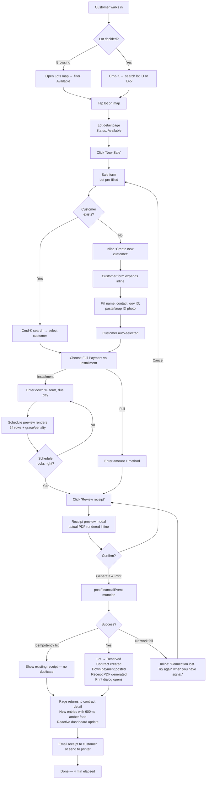
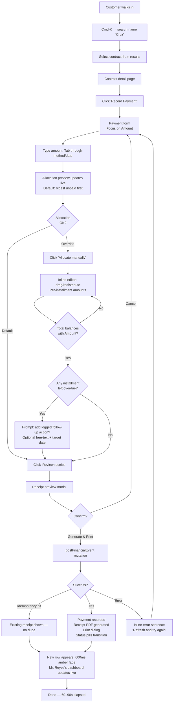
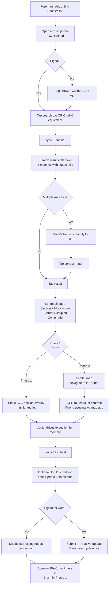
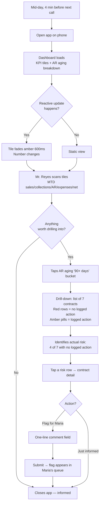

# UX Design Specification — cemetery-mapping

**Author:** theundead
**Date:** 2026-05-17

---

<!-- UX design content will be appended sequentially through collaborative workflow steps -->

## Executive Summary

### Project Vision

The product replaces a paper-based cemetery's four broken workflows with a single reactive web app. The PRD's vision is correct; from a UX angle it becomes more specific:

- **Office staff finish a sale in 4 minutes** (down from ~30 minutes on paper) — UX's job is friction removal, not feature exposure.
- **Field workers locate any lot in < 5s by search** (Phase 1) and **< 30s physically by GPS** (Phase 2) — search-first, map-second, holds across both phases.
- **Owners answer business questions in < 90s from the dashboard** — glanceable tiles + progressive drill-down.
- **Customers (Phase 3) pay an installment in seconds** — minimum friction from the GCash-app context to receipt-in-inbox.

The product's UX signature is **calm, reactive, predictable**. When a payment lands in Maria's office, Mr. Reyes's dashboard updates without his phone making a sound — the change just appears. That quiet live-sync is the differentiator users will feel.

### Target Users

| Persona | Device & context | UX-relevant traits | Design implications |
|---|---|---|---|
| **Maria — Office Staff** (Journey 1, 2) | Desktop, indoor, 1366px+ keyboard-first | 6 years domain experience; fast typist; doesn't need hand-holding; spends 6 hours/day in this app once go-live | **Keyboard navigation through every flow**, sensible defaults, inline validation, no modal interruptions during entry, dense info layouts. Friction at 100 keystrokes/day adds up. |
| **Junior — Field Worker** (Journey 3) | Mid-range Android phone, outdoor, 2–4 bars 4G, may wear work gloves, walking / driving | Used to texts / calls more than apps; signal sometimes drops; direct sunlight on screen; one-handed phone use | **44+px touch targets**, high contrast mode (sunlight-readable), large tap zones, minimal chrome, offline indicator clear, search-first not map-first |
| **Mr. Reyes — Admin / Owner** (Journey 4) | Phone primary, occasional desktop, ~90s between meetings | Time-poor; glances at dashboard mid-day; rarely drills down deeply; flags items for staff | Glanceable KPI tiles with **font sizes generous on mobile**, progressive drill-down, single-tap flag-to-staff, no nested menus |
| **Aling Nena's daughter — Customer** (Journey 5, Phase 3) | Phone-only, GCash app in background, possibly first-time portal user | Mobile-first context, low patience for friction; wants confirmation visible | **One-screen-per-task** flow, big receipt confirmation, email-the-PDF as default, no surprise required fields |

### Key Design Challenges

Ordered by how much value is at risk if we get them wrong:

1. **Office staff transactional speed (Journey 1).** The sale form is the highest-traffic complex UI in the system. It combines: lot picker (search + visual confirm), customer picker or inline-create (with ID photo upload), installment-schedule preview (24+ rows of dates + amounts + rules), and atomic submission with BIR receipt printing. If this takes longer than 4 minutes, the product fails its core success metric. Design challenge: **dense without overwhelming, keyboard-driven without sacrificing visual lot / customer confirmation**.

2. **Installment-schedule preview (Journey 1 climax).** A 24-row payment schedule is dense data. Showing it as a literal table is easy and unloved. The challenge is making it **scannable** ("when does she finish paying?") **and** **editable** ("she wants Dec 15 instead of Dec 5") **and** **legally exact** (the form is a contract preview). The architecture's `SchedulePreview` component is named; this is where UX adds the most value.

3. **Field worker outdoor mobile experience (Journey 3).** Sunlight on a phone screen kills default light-on-light typography. Gloves shrink the usable touch target. Cemetery signal varies. UX must deliver a **high-contrast theme**, **44+px touch targets**, **clear offline-cached indicator**, and a **search-first interaction model** (typing or voice-searching for "Bautista" must be the primary path — the static-map Phase 1 view is the secondary path).

4. **Map UX across Phase 1 → Phase 2 transition.** Phase 1 ships an SVG / image overlay (no GPS); Phase 2 swaps in Leaflet + GPS routing. The component swaps cleanly per architecture, but the **user model has to stay stable** — search-first throughout, with the map serving as visual confirmation. If field workers learn one interaction model in Phase 1 and a different one in Phase 2, that is a UX regression even if both render correctly.

5. **AR-aging surfacing for the owner (Journey 4).** Raw "₱1.8M in 90+ days" terrifies. "₱1.8M in 90+ days, 90% with logged follow-up" tells the truth. The dashboard must make the **distinction between silently-overdue and overdue-with-action visible at a glance**, not buried in a drill-down. If it doesn't, owners will lose trust in the dashboard within a month.

6. **BIR receipt confidence loop.** The receipt is a legal document. Once issued, it is immutable per architecture. The office staff needs to **see what is about to be issued before clicking "Generate"**, and needs **clear visual confirmation after** ("Receipt #00001234 issued, PDF generated, emailed to mrs.cruz@..."). One misprinted receipt is a real BIR audit risk; UX must prevent rushed-confirmation errors.

7. **Status communication everywhere.** The product has many statuses: lot status, contract state, installment state, payment status, receipt state, expense approval (Phase 2), interment status (Phase 2). The PRD's NFR-A2 mandates color + icon + label. UX challenge: **one reusable status component** that scales from a 16px badge on a list row to a 32px chip on a detail page, always accessible, always color-blind-safe.

8. **Reactive update affordances (the "aha moment").** When server state changes mid-page (the owner sees a payment land), the UI should signal it without being noisy. **A 600ms highlight + subtle slide-in** on the dashboard tile that changed is the right pattern. Too subtle = missed; too loud = office staff hate it on the payment-intake screen.

### Design Opportunities

Where great UX could move beyond "competent enough" into "people enjoy using this":

1. **Status pill as the system's primary visual element.** One well-designed component carries enormous narrative weight — color + icon + label, sizes from 16px to 32px, animates on state change, works at distance (across an office computer screen) and up-close (mid-glove on a phone). This is the brand of the product.

2. **Search-as-primary-navigation.** Most CRUD apps make users navigate hierarchies. For Maria and Junior, **cmd-K-style global search** (lots / customers / contracts / receipts by ID or name) is faster than every secondary nav option. Architecture supports it (Convex queries are cheap).

3. **Installment schedule as a timeline, not a table.** A horizontal row of 24 monthly dots — paid (filled), current (highlighted), due (empty), missed (red ring) — communicates contract state in one glance. Tap a dot for detail, tap-and-drag (Phase 2 maybe) to adjust due dates. Visually scannable for both Maria and the customer-portal in Phase 3.

4. **Outdoor mode as a single user-controllable setting.** A toggle in the user menu (and respect the OS-level `prefers-color-scheme: dark` and `prefers-contrast: more`). One tap from sunlight to readable. Saved per-user across sessions.

5. **Receipt preview-modal as a calm pause.** The architecture makes receipts immutable; the UX should mirror that with a deliberate 1-second pause to review before issuance. Not a confirmation dialog (those get muscle-memoried into clicks); a **preview modal showing the actual PDF content** with a clear primary action.

6. **Reactive change indicator as a calm flash, not a notification.** When a tile updates server-side, a 600ms `bg-amber-50` fade highlights what changed, then settles back. No badges, no toasts, no popups. The owner doesn't need to be alerted — they need to be reassured.

## Core User Experience

### Defining Experience

The product has **four distinct core loops** across its personas; UX must serve all four, but design priority is set by frequency × cross-cutting impact:

| Persona | Core loop | Frequency | Cross-cutting impact |
|---|---|---|---|
| **Maria** (Office Staff) | **Record a payment** + issue BIR receipt | 30–50 / day at peak | Touches every architectural cornerstone (`postFinancialEvent`, audit, receipt, reactive update). Visible to owner instantly. |
| **Maria** (Office Staff) | Record a sale on installment | ~10 / day | Highest single-transaction complexity (Journey 1 — 4-minute target) |
| **Mr. Reyes** (Owner) | Glance at dashboard, drill if needed | 1–3 / day, ~90s each | Where trust in the product is won or lost |
| **Junior** (Field Worker) | Search for a lot on phone | Multiple times per shift | Field extension of the product; secondary in Phase 1, primary in Phase 2 |
| **Aling Nena's daughter** (Customer, P3) | Pay an installment online | Monthly | The customer-facing UX represents the cemetery's brand |

**The lead design loop is Maria recording a payment.** It is the most frequent transaction, validates every architectural invariant, and produces the "aha" moment (the owner sees the payment land in real time). If this loop is friction-free, the product earns its keep every working day. Sale-on-installment is the most complex single flow, but it is the slow-and-careful flow — different UX target.

### Platform Strategy

Multi-context responsive web app (per PRD § Web App Requirements and architecture decisions). Specific UX implications:

| Context | Primary input | Visual density | Critical UX adjustments |
|---|---|---|---|
| **Desktop office (Maria, Mr. Reyes alt)** | Keyboard + mouse, mouse secondary | High — dense forms, multi-column dashboards, ≥ 1366px | Full keyboard navigation, cmd-K global search, dense forms with inline validation, no modal flow interruptions |
| **Phone field (Junior)** | One-handed touch, possibly gloved | Low — single column, large touch targets | 44+px tap targets, outdoor-readable contrast (toggle), PWA offline read, search-first navigation, no horizontal scroll |
| **Phone owner (Mr. Reyes primary)** | Touch, brief sessions | Medium — glanceable KPI tiles | Big tap targets for drill-down, mobile-first dashboard layout, reactive change indicators visible at-a-glance |
| **Phone customer (Phase 3)** | Touch + GCash app context-switch | Low — one-screen-per-task | Big primary buttons, deep-link from GCash back to portal, receipt email always |

**Platform commitments:**

- Responsive single codebase (no separate mobile app — PRD locks this)
- PWA registered in production only (NFR + architecture)
- Touch targets meet NFR-A4 (44+px) globally, including the desktop UI (no regressions if Maria works from a touch laptop)
- Keyboard navigation works for every Maria flow (NFR-A3) — `Tab` order matches reading order, `Esc` cancels modals, `Enter` submits forms, `?` shows shortcuts

### Effortless Interactions

Where the product should feel like the system anticipated the user:

1. **Lot picker autocomplete.** Type "D-5" and the lot list filters to D-5-1, D-5-2, D-5-3… as you type. Tap a result and the lot detail (status, price, dimensions) appears next to it. No "search" button. No second screen.
2. **Customer picker with inline-create.** Search by name. If found, pick. If not found, the form to create them is one keystroke away, inline (not a separate screen). ID photo upload via paste-from-clipboard or camera capture; both supported on mobile, paste preferred on desktop.
3. **Payment allocation defaults to oldest-unpaid.** No clicks needed for the default path. The override is one button: "Allocate manually" → opens an inline distribution panel. Journey 2's complexity is hidden behind a default that's right 90% of the time.
4. **Reactive cross-role sync.** Mr. Reyes never refreshes. When Maria posts a payment, his dashboard tile updates with a 600ms `bg-amber-50` fade. No alert, no badge, no toast. He just notices the number changed.
5. **Receipt generation is one click after preview.** The preview modal IS the confirmation; clicking "Generate & Print" both issues the receipt and starts the print dialog. No "are you sure" intermediate step.
6. **Search-as-navigation everywhere.** Cmd-K (Ctrl-K on PC) opens a global search bar from any page. Type "Bautista" → see customers, contracts, payments matching. Tap or Enter to navigate. Field workers see the same UI as office staff.
7. **Idempotent retries.** If Maria's browser hiccups mid-receipt, she clicks "Generate" again. The system recognizes the idempotency key (per architecture) and shows her the already-issued receipt, not a duplicate. She doesn't have to know what happened.
8. **Filipino-localized money and date formats.** ₱1,250.00 with the peso symbol. "17 May 2026" date format. Manila timezone always. Maria never thinks about timezone bugs.

### Critical Success Moments

The moments where users decide whether to trust the product:

1. **Maria's first full sale + receipt (Journey 1, day 1).** Target: < 4 minutes from "New Sale" click to "Receipt printed." If this is slow or confusing on day 1, she goes back to paper for the next sale.
2. **Maria's first missed-payment recovery (Journey 2, week 1).** Target: < 30 seconds to attach a logged follow-up action to an overdue installment. If she has to remember a multi-step process, she will not bother.
3. **Mr. Reyes's first dashboard glance (week 1).** Target: < 90 seconds from opening the app on his phone to a clear picture of MTD position. If he has to scroll, zoom, or interpret, the product loses him.
4. **Junior's first field lookup (week 2).** Target: < 5 seconds from app-open to lot detail visible. Outdoors, on 4G. If the spinner spins for 5 seconds, he calls Maria instead.
5. **First reactive update Mr. Reyes sees.** A payment lands while he has the dashboard open. The tile fades amber, the number updates. **This is the product's "magic moment"** — needs design care: not too subtle (he misses it), not too loud (Maria hates it during data entry).
6. **First BIR audit (Phase 1, ~3 months in).** The accountant asks for receipts #00001000–#00001200. The export takes < 30 seconds, all serials present, no gaps. UX role: the export must be findable in 2 clicks from the audit log page.
7. **First Phase 3 customer payment via GCash.** Aling Nena's daughter taps "Pay" → confirms in GCash → returns to portal showing "Paid ₱4,000, 13 installments to go" with receipt downloaded. < 30 seconds end-to-end. If GCash deep-link returns to the wrong page, she is confused and the cemetery gets a support call.

### Experience Principles

Guiding all UX decisions:

1. **Calm reactivity.** Server-driven changes update the UI with a 600ms fade highlight, never with alerts, badges, or toasts. The owner gets reassured; the office staff does not get interrupted.
2. **Search-first navigation.** Cmd-K (Ctrl-K on PC) finds anything from anywhere. The sidebar nav is for orientation, not navigation.
3. **Keyboard-respectful.** Every flow Maria uses works without a mouse. Tab order, focus rings, `Esc` / `Enter` semantics matter. Field worker is touch-first, but desktop UX is keyboard-first.
4. **Status as story.** Color + icon + label everywhere. One reusable `StatusPill` component, three sizes (16 / 24 / 32 px), color-blind-safe palette, label always visible.
5. **Confidence before commit.** For immutable actions (issue receipt, transition contract state, finalize sale), the user sees what's about to happen via a preview pane — not a "Are you sure?" dialog. Previews are reviewable; dialogs get muscle-memoried-through.
6. **Outdoor mode on demand.** Single toggle in the user menu (and respect `prefers-contrast: more`). One tap from sunlight to readable. Saved per-user across sessions.
7. **Honest empty + loading states.** Skeletons (not spinners) for content, mid-page spinners only on in-flight mutations. "No results" never visually confused with "loading."
8. **Filipino localization is visible everywhere.** Peso symbol, peso-grouped numbers, Manila timezone, "17 May 2026" date format. The product speaks the user's context.
9. **Errors are sentences, not codes.** Every server error translates to a sentence Maria can act on ("This receipt serial was already issued — try refreshing"). Underlying `ConvexError` codes never reach the user.
10. **Reactive ≠ surprising.** Reactive updates are great; auto-navigation is not. The page the user is on never changes underneath them. Updates happen within the page, never to it.

## Desired Emotional Response

### Primary Emotional Goals

The product's emotional signature is **quiet competence** — like a well-worn pen that does what the writer expects, every time, without ceremony. Different personas need different shadings of this:

| Persona | Should feel | Should not feel |
|---|---|---|
| **Maria** (Office Staff) | **Confident, capable, trusted, calm** — like the tool extends her competence rather than gating her work | Anxious, hurried, doubted, surprised, infantilized by "are you sure?" dialogs |
| **Junior** (Field Worker) | **In control, connected to the office, informed** (even when offline) | Helpless, frustrated, isolated, embarrassed by an app failing in front of a customer |
| **Mr. Reyes** (Owner) | **Informed without effort, in command, reassured** by what he sees | Blindsided, overwhelmed by raw numbers, alarmed by aging totals without context |
| **Aling Nena's daughter** (Customer, P3) | **Respected, reassured, calm** — the cemetery is handling her family with care | Harried, marketed-to, uncertain, surprised by costs, addressed casually |

The deliberate non-goal: **delight**. This product replaces life-critical paper records. Users should feel "this is reliable" — not "this is fun." Excited emotional responses in this domain read as inappropriate; "delight" as a UX goal can produce gamification or celebratory animations that feel wrong against a backdrop of bereavement and family finances.

### Emotional Journey Mapping

Mapped against PRD Journey 1 (Maria selling a lot on installment) — the most emotionally consequential flow:

| Stage | Maria's state | Design support |
|---|---|---|
| **Sees the Cruzes walk in** | Mild anticipation; mental switch to "sale mode" | App opens to her usual workspace, no nag-screens or notification badges |
| **Clicks "New Sale"** | "Here we go" — focus | Fast page transition (< 200ms), focus auto-lands on the lot picker |
| **Types "D-5"** | "System gets me" — satisfaction | Autocomplete results appear in < 100ms, top result highlighted, Enter selects |
| **Picks the Cruzes (or creates them)** | "Didn't have to switch screens" — relief | Inline create form expands within the picker; ID-photo paste from clipboard |
| **Sets installment terms, sees schedule preview** | "This is what I'm about to commit to" — confidence | Schedule preview visually scannable; grace + penalty rules shown plainly |
| **Reviews receipt preview modal** | "I see what I'm issuing" — confidence + deliberate pause | Modal shows the actual PDF content; single primary action button |
| **Clicks "Generate & Print"** | "The system is doing what I asked" — calm | No spinner anxiety; the print dialog opening IS the feedback |
| **Receipt prints, page returns to sale list with new entry** | "Done. In 4 minutes." — quiet accomplishment | New entry has a 600ms `bg-amber-50` fade-in; no popup, no toast |
| **(Mid-day) Mr. Reyes opens his dashboard** | "We're working" — reassurance | The MTD sales tile shows the ₱16,000 with a calm amber-fade if he was already on the page |

For the failure path — Maria's first time encountering a server error:

| Stage | Maria's state | Design support |
|---|---|---|
| **Clicks "Generate Receipt"** | Expectation of success | Standard preview-then-commit flow |
| **Server returns error mid-mutation** | "What just happened?" — momentary doubt | Inline error message in a sentence she can act on: "This receipt serial was already issued. Try refreshing your view." |
| **Refreshes, sees the receipt already exists** | "OK, system was right, no harm done" — restored confidence | The earlier receipt is visible with its serial; no duplicate created (idempotency); no scolding microcopy |

### Micro-Emotions

Subtle but important emotional states across the product:

| Polarity | Where it appears | Design lever |
|---|---|---|
| **Confidence** vs. confusion | Schedule preview, receipt preview, contract state-change confirmation | Preview-before-commit pattern (show the consequence, not just a Y / N question) |
| **Trust** vs. skepticism | Reactive cross-role updates, audit log visibility | Show users what the system did (audit log entries, immutable receipt records) |
| **Calm** vs. anxiety | Every reactive update, every loading state | 600ms fades, skeletons not spinners, no toasts / badges / popups |
| **Accomplishment** vs. frustration | Receipt issued, payment recorded, follow-up logged | Quiet confirmation that the action happened (visible change), not celebratory microcopy |
| **Capability** vs. being-guarded | Keyboard shortcuts, sensible defaults | No "are you sure" dialogs except on truly irreversible actions (void receipt, reclaim lot) |
| **Reassurance** vs. blindsiding | AR aging tile, dashboard drill-downs | "₱1.8M in 90+ days, 90% with logged follow-up" not "₱1.8M overdue!" |
| **Respect** vs. condescension | Customer portal copy (Phase 3), error messages | Formal address, complete sentences, no infantilizing "Oops! Something went wrong!" |
| **Belonging** vs. isolation (field worker) | PWA offline indicator, cached-data freshness | Honest about state: "Cached, last synced 12 min ago" |

### Design Implications

| Desired feeling | UX design approach |
|---|---|
| **Confidence** | Preview-before-commit; clear post-action visible change; idempotent retries that don't punish the user; audit log surfaces what the system did and when |
| **Calm** | 600ms `bg-amber-50` fade on reactive updates (never toasts / badges / popups); skeletons during loading; subdued color palette (no electric blues, no neon greens) |
| **Capable** | Keyboard shortcuts on every Maria flow; sensible defaults (auto-allocation, "today" for dates); dense layouts that respect her expertise |
| **Reassured** | Reactive cross-role updates ("the payment is real, you're not imagining it"); explicit "no data" vs. "loading" states; AR aging contextualized with "X with logged action" |
| **Respected (customer-facing)** | Formal English copy in Phase 3 portal; no upsells, no marketing, no celebratory microcopy; "Thank you" never "Awesome!" |
| **Trusted** | Permission gating done quietly (redirect, don't nag); single-source-of-truth data; no "Are you sure?" friction except on truly irreversible actions |
| **In control (field worker)** | Touch targets ≥ 44px; outdoor-readable mode one tap away; clear cached-data indicator; offline-write attempt warns clearly ("posting payments requires connection") |

### Emotional Design Principles

1. **Calm reactivity over notification anxiety.** Updates fade in over 600ms. Never alerts, badges, toasts, or popups. The system is reactive *because* the user should not have to refresh — not because it wants their attention.

2. **Confidence loops, not confirmation dialogs.** Show the user what they are about to commit to (receipt preview, schedule preview, state-transition reason). Let them review and act. "Are you sure?" dialogs get muscle-memoried-through and damage trust both ways.

3. **Subdued tone.** Cemetery domain is sensitive. No celebratory animations on payment posted. No exclamation marks in microcopy. No "Boom!" / "Awesome!" / "" anywhere. Acknowledgment, not celebration.

4. **Trust users, gate fewer things.** No "are you sure" except for irreversible + impactful actions (void receipt, reclaim lot, default contract). The keyboard works. Defaults are right 90% of the time. The product respects 6 years of Maria's domain expertise.

5. **Quiet competence everywhere.** Fast loads, predictable interactions, accurate state. The brand feeling is "this is reliable," not "this is exciting."

6. **Honest about state.** "Cached, last synced 12 min ago" beats a spinner that hangs. "Receipt #1234 issued, emailed to mrs.cruz@..." beats "Success!" Cached, stale, offline, loading, error — each has its own visual treatment, never confused.

7. **Errors as conversations, not failures.** "This receipt serial was already issued — try refreshing your view." Not "Error: DUPLICATE_KEY." Not "Oops!" Sentences Maria can act on, in the same tone the rest of the product uses.

8. **Filipino-respectful customer-facing copy.** Phase 3 portal uses formal English at minimum (or formal Filipino if i18n is added). Customers are addressed as adults handling a serious family responsibility.

9. **The reactive update is the magic moment — keep it sacred.** When Mr. Reyes refreshes his dashboard and sees a payment that just landed, the 600ms amber fade IS the product's defining emotional moment. Test it. Get the timing right. Protect it from feature creep.

10. **Empty states are not failure states.** "No overdue contracts" is a quiet success, not an empty dashboard. Design the no-data view as a calm confirmation, not an absence.

## UX Pattern Analysis & Inspiration

### Inspiring Products Analysis

| Product | What it solves well | What we learn |
|---|---|---|
| **Linear** | Calm reactive ops tool for engineering teams. Cmd-K everywhere. No notification noise. Multi-user cursors and live state without anxiety. | The gold standard for "search-first navigation" and "calm reactivity." Maria's office tool should feel like Linear's keyboard-respectful density, not Jira's modal-heavy bureaucracy. |
| **Stripe Dashboard** | Financial integrity at scale. Immutable transaction records with full audit history. Drill-down from aggregate metrics → individual events → underlying data. Real-time updates that just *appear*. | Direct map onto Mr. Reyes's dashboard + Maria's payment flow. Status pills, dense tables, calm change-indicators, audit-log presentation. The receipt detail page should feel like a Stripe transaction detail. |
| **Notion** | Reactive multi-user editing where you see collaborators' changes mid-page without flicker or scroll. Cmd-K global search across pages and content. | The "you don't refresh, the page just updates" model is exactly what Maria + Mr. Reyes + Junior should experience together. |
| **Google Maps mobile** | Field-worker map UX gold standard. GPS routing, search-first ("type your destination"), gradually-loaded tiles, offline-cached areas, transit directions when relevant. | Phase 2 field-worker flow. Junior's "navigate to lot" experience should mirror "navigate to address" — type, see route, follow. |
| **Apple's "Find My"** | Calm offline-aware mobile UX. Shows you what is known (last seen 12 min ago), distinguishes live from cached, never lies about state. | Field-worker PWA cache UX. "Cached, 12 min ago" vs. "Live" indicator. Honest about state in a way that builds trust. |
| **WhatsApp** | Message-delivery state visualization (single tick / double tick / read). Tiny, glanceable, communicates a lot. | Model for cached / synced / pending / committed state across the product. |
| **QuickBooks Online** | The bookkeeper's workflow. Reconciliation views, audit trail, voided-but-recorded transactions, BIR-equivalent (US 1099 / W-9) compliance UX. | Direct map onto reconciliation invariant UI and BIR receipt format / serial handling. Maria's accountant will already think in this idiom. |

### Transferable UX Patterns

**Navigation patterns:**

- **Cmd-K global search** (Linear, Notion) → Cmd-K finds lots / customers / contracts / receipts from anywhere. Faster than every sidebar option. Single most-impactful UX adoption.
- **Persistent sidebar with collapsed icons** (Linear, Stripe) → primary nav stays visible at the page's left edge, single-row icons by default, expands on hover / click. Mr. Reyes on mobile gets a different drawer.
- **Breadcrumb + page-title-as-action** (Stripe) → page title doubles as primary nav anchor; breadcrumb shows hierarchy without sacrificing screen real estate.

**Interaction patterns:**

- **Inline-create within picker** (Notion, Stripe's customer picker) → if you do not find what you're searching for, the create-form appears in the same surface. Adopt directly for customer-picker-with-inline-create in the sale flow.
- **Optimistic UI with reactive correction** (Linear) → most actions update the UI before the server confirms, with a quiet correction if the server disagrees. Apply *carefully* — never on financial mutations, but yes on UI toggles, filter changes, lot-condition logging.
- **Detail pane next to list** (Stripe, Linear "issue panel") → click a row in a list, detail expands to the right (or slides in on mobile). Adopt for receipt viewer, customer detail, contract detail. Avoids modal context-switching.
- **Modal-as-preview-not-confirmation** (Stripe's "view as customer", Apple Pay's transaction preview) → the modal shows what's about to happen; the primary action button commits it. No second "Are you sure?" step. Direct fit for our receipt preview modal.

**Visual patterns:**

- **Status pill with color + icon + label** (Linear's issue states, Stripe's payment states) → universal pattern across the product. Three sizes. Color-blind safe palette. Adopt as our primary `StatusPill` component.
- **Skeleton loaders matching final layout** (Stripe, Linear) → reduces perceived loading time. Skeleton rows in tables match the column widths and densities they'll become.
- **Subtle "highlight on change" animation** (Stripe Dashboard, Linear) → 600ms `bg-amber-50` fade on the cell that just updated. Adopt directly for reactive update affordance.
- **Dense-by-default with explicit "expand"** (Stripe transaction list, Notion's compact mode) → information dense by default, expanding individual rows for detail. Respects Maria's expertise; doesn't waste screen real estate.

**Form patterns:**

- **Stripe's checkout flow** → progressive disclosure of complexity. Simple fields first, advanced options behind a clear toggle. Direct map onto installment-sale form (down payment + term up front; grace + penalty rules in an "Advanced terms" expandable section).
- **Notion's inline-edit** → fields editable in-place where they're displayed. Adopt for customer detail view (edit address inline) where the architecture's PII boundary allows.

**Mobile patterns:**

- **Google Maps' search-first** → the search bar IS the navigation. No "browse by section" hierarchy. Direct adoption for Junior's lot lookup.
- **WhatsApp's offline-aware tick system** → glyph-based state indicator (cached / live / posting / posted / failed). Model for Junior's "Action queued (no signal)" — except that we do not queue writes; we hard-block them.
- **Apple's Find My "last seen"** → time-since indicator pattern for PWA cache freshness. "Lot data: 12 min ago" rather than "Synced" / "Not synced."

### Anti-Patterns to Avoid

- **Salesforce Lightning-style customization-everywhere.** Maria does not need 47 ways to view a sale. One opinionated layout, dense and predictable. Customization is a customer support burden disguised as a feature.
- **Trello / Asana "card flair" cuteness.** Confetti emojis, "Boom!" celebrations, casual microcopy ("Heck yeah!"). Wrong tone for cemetery + financial documents.
- **Bank-app modal-everything.** "Confirm your transaction" → "Confirm again" → "Verify with OTP" → "Are you really sure?" punishes users for every action. Use preview modals, not confirmation dialogs.
- **PoS terminal density-without-care.** Old POS systems are dense because they have to be, not because they were designed to be readable. Adopt density on purpose with typography and spacing care.
- **Apple Pay-style payment celebration.** Confetti, haptic feedback, "Done!" — wrong domain. Payment posting is solemn business; the UX is "yes, this happened" not "yay!"
- **Slack-style ambient notifications.** Red badges, "(1)" titles, growl-like popups. The product is reactive *because* the user should not have to monitor it; surfacing every change as a notification defeats the architecture.
- **Material Design's FAB (floating action button) on desktop.** The big circular "+" obscures content and breaks keyboard navigation. Use a normal "New Sale" button in the toolbar.
- **Carousels** for anything important (Phase 3 customer portal). Users miss them, accessibility is poor, and they add motion to a domain that wants stillness.
- **Loading spinners on top of stale content.** Either show cached data with a freshness indicator (Junior's PWA), or show a skeleton (Maria's first-load). Spinner-on-top is "I have no idea what's happening" UX.
- **PDF previews implemented as image renders.** Real PDF preview (browser-native PDF viewer in an iframe / modal) is the only acceptable receipt preview — fuzzy image renders create doubt at exactly the moment we want confidence.

### Design Inspiration Strategy

**Adopt directly** (apply the pattern as-is):

- **Linear's calm reactive model** → server changes flow to UI without alerts / badges / toasts; 600ms amber fade is the reactive change indicator.
- **Linear's Cmd-K global search** → primary navigation for office staff and field worker (cross-platform: Ctrl-K on PC, ⌘-K on Mac, search button in mobile header).
- **Stripe's preview-not-confirmation modal** → receipt preview, contract preview, payment-allocation override preview.
- **Stripe's drill-down dashboard** → MTD / YTD tiles → aging buckets → individual contract → payment history. Each level is its own reactive page; no modals layered on modals.
- **Notion's inline-create-in-picker** → customer picker with create-new inline; lot picker shows "no match — create new lot" only when the search is unambiguous.
- **Apple Find My's freshness indicator** → "Last synced 12 min ago" on the field-worker PWA cache, always visible.

**Adapt** (modify for our context):

- **Google Maps' search-first mobile** → adapt for the cemetery's static-map Phase 1 (search returns lot detail + section overlay) and dynamic-map Phase 2 (search → route via GPS).
- **WhatsApp's tick system** → adapt for transaction state visualization (pending → posting → posted with receipt → reactive update visible elsewhere). Subtler than WhatsApp's literal ticks; could be color-coded `StatusPill` states.
- **Stripe's transaction immutability UX** → adapt for receipt-as-legal-document. Voided receipts show as voided with their serial preserved; reversals create new records. Maria's confidence comes from seeing the full history, not from being told "everything is fine."
- **QuickBooks-style reconciliation** → adapt the daily reconciliation-invariant UI into the dashboard's "system health" tile. Architect specified the scheduled function; UX needs to design how its failures surface to admins.

**Avoid** (explicitly do not adopt):

- Any Salesforce-style customization layer, view-builder, or report-builder. Opinionated layouts only.
- Any celebratory animation on financial action completion. The page just updates.
- Any modal stacked on modal. Drill-downs are pages or panes, never nested overlays.
- Any "loading…" spinner that covers cached content. Skeletons for first-load; freshness indicators for cached.
- Any FAB or other floating-on-content UI element on desktop.
- Any badges or red dots on nav items. The architecture flag-for-staff feature surfaces in a queue page, not a badge.

## Design System Foundation

### Design System Choice

**shadcn/ui + Radix primitives + Tailwind CSS** (themeable, copy-into-repo). This was locked in the architecture phase; the UX rationale is fully aligned:

| Approach | Trade-off | Why it fits this product |
|---|---|---|
| **Custom design system** | Full visual uniqueness, highest investment | No — single-cemetery client does not need a brand-distinctive UI, and a freelance-single-engineer build cannot sustainably maintain a custom system. |
| **Established system** (Material, Ant Design) | Fast, but visually generic; React component APIs imposed by the system | No — Material's loud color + ripple animations do not fit "quiet competence"; Ant Design's enterprise aesthetic feels heavy. |
| **Themeable foundation** (shadcn/ui, Chakra, MUI) | Strong base + brand flexibility, moderate learning curve | **Yes — shadcn/ui specifically.** |

Why shadcn/ui over Chakra / MUI:

- **Code lives in our repo.** Components are copy-pasted, not imported from a package. No upstream version churn, no "but how do I customize this small thing." Matches NFR-M4 (cemetery owns the code).
- **Tailwind-native.** Zero CSS-in-JS runtime cost (NFR-P6 bundle budget). Tailwind tokens flow through every component.
- **Radix primitives underneath** — accessibility (NFR-A1 WCAG 2.1 AA) is built into the unstyled behavior layer. Focus management, keyboard nav, ARIA — already correct.
- **Patternspeak fits Linear / Stripe inspiration.** The shadcn/ui aesthetic is the "calm SaaS" register we are targeting.

### Rationale for Selection

1. **Architectural fit (NFR-M4 + NFR-M1).** Code-in-repo model means we own the UI components the same way we own `convex/lib/postFinancialEvent.ts`. No upstream surprises during BIR audit prep.
2. **Accessibility-first via Radix** (NFR-A1, A3, A6). The hard accessibility problems — focus traps in modals, keyboard navigation in popovers, screen-reader announcements — are already solved.
3. **Performance budget** (NFR-P6 < 250KB initial bundle gzipped). No runtime CSS engine; Tailwind builds at compile-time.
4. **Inspiration alignment.** Linear and Vercel both ship variations of this stack — visually proven for the "calm reactive SaaS" register.
5. **Freelance-team sustainable.** No need to keep up with breaking changes in an external design system; the components in the repo are the components forever (with whatever evolution we apply intentionally).

### Implementation Approach

The design system is **three layers**:

```
Layer 3: Domain components       ─►  LotMap, SchedulePreview, StatusPill,
                                     KpiCard, ReceiptViewer, ArAgingTable,
                                     SaleForm, PaymentForm
                                          │
Layer 2: shadcn/ui components    ─►  Button, Input, Dialog, Sheet, Command,
                                     Form, Select, Table, Badge, Skeleton,
                                     ToastViewport (used sparingly)
                                          │
Layer 1: Foundations             ─►  Radix primitives + Tailwind tokens +
                                     fonts + animation timings
```

**Layer 1 — Foundations.** Tailwind config + custom design tokens (below). Radix primitives provide accessibility-correct behavior.

**Layer 2 — shadcn/ui components.** Copy what we need, when we need it. Initial set for Phase 1:

- `Button`, `Input`, `Textarea`, `Select`, `Checkbox`, `Switch` — forms
- `Dialog`, `Sheet` (slide-in panel) — modals + side panels
- `Command` — the cmd-K global search
- `Form` — RHF + Zod integration wrapper
- `Table` — dense data lists
- `Badge` — base for `StatusPill`
- `Skeleton` — loading states
- `Tabs`, `Accordion` — progressive disclosure
- `Toast` — used only for permanent system messages (offline indicator, version refresh prompt) — NOT for action confirmations
- `Popover`, `Tooltip` — secondary info on hover / focus

**Layer 3 — Domain components.** The ones architecture named in the file tree. Built on top of layers 1 + 2:

- **`StatusPill`** — the product's primary visual element
- **`LotMap`** — SVG renderer (P1) / Leaflet renderer (P2), with consistent search-first interaction
- **`SchedulePreview`** — installment-schedule visualization
- **`PaymentForm`**, **`SaleForm`**, **`CustomerForm`** — the high-traffic transactional forms
- **`KpiCard`** — dashboard tile with reactive-fade behavior
- **`ArAgingTable`**, **`ReceiptViewer`** — financial views
- **`StatePillTransition`** — animates between status states (300ms color crossfade)
- **`ReactiveHighlight`** — wraps any element to apply the 600ms amber fade when its value changes

### Customization Strategy

#### Design tokens (Tailwind config)

**Color palette** — subdued and professional, color-blind safe by combining with icons + labels.

```ts
// tailwind.config.ts — extracted tokens
colors: {
  // Primary action — subdued, not the standard SaaS bright blue
  primary: {
    DEFAULT: 'slate-800',    // #1e293b — page-action buttons
    fg: 'white',
    hover: 'slate-900',
  },
  // Surface
  surface: {
    DEFAULT: 'white',
    muted: 'slate-50',       // page background
    raised: 'white',         // card backgrounds
    border: 'slate-200',
  },
  // Text
  text: {
    DEFAULT: 'slate-900',
    muted: 'slate-500',
    subtle: 'slate-400',
  },
  // Status colors (paired with icon + label always — NFR-A2)
  status: {
    available:    'emerald-600',   // ✓ Available
    reserved:     'amber-500',     // ⏱ Reserved
    sold:         'slate-600',     // ⊘ Sold
    occupied:     'stone-700',     // ◉ Occupied
    cancelled:    'zinc-500',      // ✕ Cancelled
    defaulted:    'red-600',       // ⚠ Defaulted
    transferred:  'indigo-600',    // ➔ Transferred
  },
  // Payment / installment states
  payment: {
    paid:         'emerald-600',
    current:      'slate-600',
    due:          'amber-500',
    overdue:      'red-600',         // silently overdue — alarming
    overdueWithAction: 'amber-600',  // intentionally lower-alarm than red — has logged followup
  },
  // Reactive update highlight
  flash: 'amber-50',                 // bg-amber-50 for 600ms fade
}
```

**Outdoor / high-contrast mode** — via `[data-theme="outdoor"]` selector. Pure-black-on-white, thicker borders on `StatusPill`, max-contrast button states. Single toggle in user menu; respects `prefers-contrast: more`.

**Typography**

```ts
fontFamily: {
  sans: ['Inter', 'system-ui', 'sans-serif'],
  // Tabular-numerics for money + IDs + serial numbers
  tabular: ['Inter', 'system-ui', 'sans-serif'],  // with font-feature-settings: 'tnum'
}
fontSize: {
  xs:    ['0.75rem',  '1rem'],    // 12 / 16 — table dense
  sm:    ['0.875rem', '1.25rem'], // 14 / 20 — body small
  base:  ['1rem',     '1.5rem'],  // 16 / 24 — body default
  lg:    ['1.125rem', '1.625rem'],// 18 / 26 — emphasized
  xl:    ['1.25rem',  '1.75rem'], // 20 / 28 — KPI tile labels
  '2xl': ['1.5rem',   '2rem'],    // 24 / 32 — KPI tile numbers (mobile)
  '3xl': ['1.875rem', '2.25rem'], // 30 / 36 — KPI tile numbers (desktop)
  '4xl': ['2.25rem',  '2.5rem'],  // 36 / 40 — page titles
}
```

**Inter** chosen because: handles Filipino characters (ñ, é, ô), excellent tabular numerics built-in, free, well-supported across browsers. Loaded via Next.js `next/font/google` to avoid layout shift.

Numbers in tables, KPI tiles, receipt serials, lot IDs use `font-variant-numeric: tabular-nums` so `₱1,234.56` stacks vertically with `₱  890.00` cleanly. Required for Maria's at-a-glance scanning.

**Spacing & layout**

Tailwind defaults (4px scale). Layouts:

- **Desktop office:** max-content width 1440px, sidebar 240px expanded / 64px collapsed
- **Mobile:** full-width, 16px gutter, sticky top nav with cmd-K search trigger
- **Touch targets:** minimum 44 × 44 px globally (`min-h-[44px] min-w-[44px]`)

**Motion & animation**

| Token | Value | When used |
|---|---|---|
| `--motion-reactive-fade` | `600ms ease-out` | Reactive update highlight (bg-amber-50 → bg-transparent) |
| `--motion-page-transition` | `150ms ease-in-out` | Route changes |
| `--motion-modal-open` | `200ms ease-out` | Dialog / Sheet open |
| `--motion-modal-close` | `150ms ease-in` | Dialog / Sheet close |
| `--motion-state-change` | `300ms ease-in-out` | StatusPill color crossfade on state change |
| `--motion-skeleton` | `1400ms linear infinite` | Loading skeleton shimmer |

**`prefers-reduced-motion`** respected globally — disables decorative motion (shimmer, fade), keeps essential motion (focus transitions) under 100ms.

**Shadows / elevation**

Three tiers only:

- **None** — flat surfaces (table rows, page background)
- **Subtle** — `shadow-sm` for cards (KPI tile, customer card)
- **Floating** — `shadow-md` for dialogs, popovers, command palette

No deep shadows. Maintains the "calm" register.

**Border radius**

Tailwind's `rounded-md` (6px) default. Buttons, inputs, cards. Status pills use `rounded-full`. No rounded-3xl variants — keeps the visual register restrained.

#### Component customization conventions

**For shadcn/ui components:**

- Copy unchanged when possible
- Customize variants via the `cva` (class-variance-authority) pattern shadcn/ui uses
- Override colors via Tailwind tokens, not by editing component source
- Use the `cn()` utility (clsx + tailwind-merge) for class composition

**For custom domain components:**

- Live in `src/components/<Component>/` per architecture file tree
- Always include a Vitest test and an inline JSDoc with the component's intended use
- Compose from Layer 2 (shadcn/ui), never directly from Radix primitives or HTML — keeps consistency at one level of abstraction

**For brand customization:**

- The cemetery's logo + name appear in: top-left of sidebar, customer-portal landing (P3), receipt PDF header
- No cemetery-specific colors (until / unless the client provides brand guidelines) — palette stays subdued
- Filipino flag / cemetery imagery NOT used in product chrome — it would read as wrong-tone in financial workflows

### Storybook

**Defer to Phase 2 retrospective.** Storybook adds real value for design-system maintenance, but for a freelance build with one engineer + 0.5 UX the maintenance burden may outweigh the benefit. The shadcn/ui docs site serves as the de-facto Storybook for Layer 2 components. Layer 3 domain components get inline JSDoc + Vitest snapshot tests. Re-evaluate if the team grows past 3 engineers.

## Defining Core Experience

### Defining Experience

**Maria records a payment and issues a BIR-compliant receipt — in under 90 seconds, with zero risk of duplicate or malformed receipt, and the office owner sees the result live on his dashboard from another room.**

Compared to famous defining experiences:

- Tinder: "Swipe to match"
- Stripe Checkout: "Pay with one tap"
- Linear: "Create an issue with Cmd-K"
- **cemetery-mapping: "Type a name, record a payment, print the receipt."**

If we nail this one interaction, the rest of the product follows. The sale flow (Journey 1) is the heavier-weight variant of this same pattern. The Phase 3 customer-portal payment is the same flow with the customer as the actor. The audit log presentation, the dashboard tile, the AR aging — all derive their UX feel from how this core interaction feels.

### User Mental Model

**Maria's paper-era mental model** (what we replace):

```
Customer walks in
      ↓
"What's their contract number?"      → flip through customer index card
      ↓
"How much do they owe?"               → flip through ledger book
      ↓
"Which installment?"                  → flip through contract folder
      ↓
Write receipt by hand                 → BIR receipt booklet
      ↓
Record payment in ledger             → ledger book
      ↓
Update contract sheet                → contract folder
      ↓
File receipt copy in customer folder → customer folder
```

Seven artifacts, three separate locations, no atomicity. A torn page, a misfiled receipt, or a power outage during entry creates discrepancies the next person inherits.

**Maria's product mental model** (what we deliver):

```
Customer walks in
      ↓
Cmd-K, type their name              → contract detail page opens
      ↓
"Record payment" button             → form
      ↓
Type amount, hit Enter              → receipt preview modal
      ↓
Click "Generate & Print"            → all 7 artifacts happen atomically
                                       (visible: contract row updates,
                                        owner's dashboard updates)
```

The mental model we **preserve**: the receipt is a legal document; the serial number is sacred; once issued, it cannot be quietly amended.

The mental model we **replace**: parallel artifacts that need manual cross-checking. The product is the artifact.

### Success Criteria

The defining experience succeeds when:

| Indicator | Target | Failure looks like |
|---|---|---|
| **Routine payment end-to-end** | < 90 seconds from customer arrival to printed receipt | Maria reverts to paper for "quick" payments |
| **Duplicate receipt rate** | 0 — even with browser refresh mid-submit | One audit finding kills trust in the system |
| **Receipt PDF print quality first-time** | 100% — no manual reprints because of malformed PDFs | Maria starts treating the print dialog as "first attempt" |
| **Cross-role reactive update visible to owner** | Within 1 second of receipt issuance, no refresh needed | The "magic" never lands; product feels like every other CRUD app |
| **Error recovery clarity** | Maria can resolve any error in < 30 seconds without calling support | Help-desk burden grows; Maria distrusts the system |
| **Keyboard-only flow** | Whole payment recordable without touching the mouse | Maria's typing flow gets interrupted 30+ times a day |

**The "smart and accomplished" moment:** Maria submits the receipt, sees the contract row update with a calm amber fade, prints the receipt with one click, and is back to her next customer in under 90 seconds. No popups. No confirmations. No "are you sure?" The system worked the way she expected.

### Novel vs. Established Patterns

This is mostly **established patterns combined deliberately**:

| Pattern | Established / Novel | Source |
|---|---|---|
| Cmd-K global search | Established | Linear, Notion, Vercel, Raycast |
| Form-with-preview-modal commit flow | Established | Stripe checkout, GitHub PR creation |
| PDF preview inside modal (native browser PDF viewer) | Established | Stripe receipt detail, every modern receipt UI |
| Reactive cross-user updates (no refresh) | Established but less common | Linear, Figma, Notion |
| Auto-allocation with one-click override | **Mildly novel** | Most accounting tools force explicit allocation; QuickBooks somewhat does this; we make the override more accessible |
| 600ms amber fade on reactive change | Established but rare | Linear, Stripe Dashboard |
| Atomic "print + email + record + audit" action | **Novel as a combination** | Each piece exists; combining them into one atomic action is unusual |
| Idempotent retry with silent dedup | Established in finance / payments | Stripe, Square — but rarely surfaced this transparently |

**The innovation is in the integration**, not in the individual patterns. The product feels new because nothing is missing — the system does what Maria would have to do manually, all in one action.

For the novel pieces (auto-allocation override; atomic print + email + record), no user education is needed — the defaults are right 90% of the time, and the atomic action is invisible.

### Experience Mechanics

The full interaction broken down:

#### 1. Initiation

**Most common path** (~80% of payments): customer walks in, Maria types their name into Cmd-K from any page.

- Press `Ctrl-K` (or `⌘-K` on Mac) → global search opens
- Type "Cruz" → results filter to "Mrs. Cruz — Contract #2024-118, family lot D-5"
- Press Enter or click → contract detail page opens
- Click "Record Payment" button (top-right of contract detail)

**Alternative path** (~15%): Maria walks the customer through their installment schedule first, then records.

- Same contract detail page
- Scroll through schedule preview to confirm what is due
- Click "Record Payment" on the specific installment row → form pre-populated with that installment's amount

**Alternative path** (~5%): bulk payment intake from sidebar.

- Sidebar → "Payments" → "+ Record payment"
- Form starts blank; Maria types customer name in the contract picker

#### 2. Interaction (the payment form)

**Layout** (desktop, 1366px):

```
┌─────────────────────────────────────────────────────────────┐
│  Record Payment — Mrs. Cruz, Contract #2024-118            │
│                                                             │
│  Amount                       Method            Date        │
│  ┌─────────────────────┐  ┌──────────┐  ┌──────────────┐  │
│  │ ₱ |                 │  │ Cash   ▼ │  │ 17 May 2026  │  │
│  └─────────────────────┘  └──────────┘  └──────────────┘  │
│                                                             │
│  Reference (optional)                                       │
│  ┌─────────────────────────────────────────────────┐       │
│  │                                                  │       │
│  └─────────────────────────────────────────────────┘       │
│                                                             │
│  ─── Allocation preview ──────────────  [Allocate manually] │
│                                                             │
│   Installment #3 (overdue)    ₱ 4,000.00  ──  Will be paid │
│   Installment #4 (current)    ₱ 4,000.00  ──                │
│   ...                                                       │
│                                                             │
│   Total amount applied:       ₱ 4,000.00                    │
│                                                             │
│                                          [Cancel]  [Submit] │
└─────────────────────────────────────────────────────────────┘
```

**Interaction details:**

- **Focus auto-lands on Amount** field on page open
- **Amount input** uses tabular numerics, peso prefix, supports `1,200` or `1200` or `1200.50` — coerced to centavos on submit
- **Method** defaults to "Cash" (most common); Tab moves to date; selecting Check / Bank reveals Reference field as required
- **Date** defaults to today (Manila tz); editable for backdated entries (admin-only); shows datepicker on click, accepts typed `17/05/2026`
- **Allocation preview** updates live as Amount changes — reactive feedback within the form before any server commit
- **Allocate manually** button expands an inline allocation editor (drag to reorder allocation, edit per-installment amount); collapsing restores default
- **Submit button** is disabled until Amount > 0; Enter submits from any field

**Validation, inline:**

- Amount > outstanding balance → warning below field: "Customer would overpay by ₱500.00 — allocate remainder to credit?"
- Amount partial → note: "Partial payment — will mark installment #3 as partial"
- Method = Check, Reference empty → error on submit: "Check number required"

#### 3. Feedback during submit

Click Submit → receipt preview modal opens:

```
┌─────────────────────────────────────────────────────────────┐
│  Review receipt before issuing                          [✕] │
│                                                             │
│  ┌─────────────────────────────────────────────────┐       │
│  │  ┃━━━ BROADHEADER MEMORIAL PARK ━━━┃            │       │
│  │                                                  │       │
│  │      OFFICIAL RECEIPT                            │       │
│  │      Serial: 0001234 (next available)           │       │
│  │      Date: 17 May 2026                          │       │
│  │      Customer: Mrs. Maria Cruz                   │       │
│  │                                                  │       │
│  │      Payment received:                           │       │
│  │      Installment #3 (overdue)    ₱4,000.00      │       │
│  │                                                  │       │
│  │      Total:                       ₱4,000.00      │       │
│  │      Method: Cash                                │       │
│  │                                                  │       │
│  │      [Cemetery TIN, BIR ATP, signatures]        │       │
│  └─────────────────────────────────────────────────┘       │
│                                                             │
│  Once generated, this receipt cannot be edited.            │
│  Voids must be recorded separately.                        │
│                                                             │
│             [Cancel]   [Generate & Print]                   │
└─────────────────────────────────────────────────────────────┘
```

This is the **deliberate pause** — Maria sees the actual document she is about to commit, not a confirmation dialog with a generic message.

The modal is keyboard-navigable: `Esc` cancels (modal closes, no changes), `Enter` commits.

Click "Generate & Print":

- Brief spinner *inside* the button (not full-page) — ~500ms typical
- Convex `postFinancialEvent` mutation runs (atomically): payment + contract update + receipt + audit log
- Convex action generates the PDF in the background
- The browser's print dialog opens automatically (using `window.print()` after PDF is ready)
- Modal closes
- Page returns to the contract detail; the new payment row appears at the top with a 600ms amber fade
- Status pill on the affected installment transitions (300ms color crossfade) from "Overdue" to "Paid"
- Email-receipt action available as a follow-up button

#### 4. Completion

**Visible state after:**

- New payment row visible on the contract detail page (faded in)
- Installment #3 now shows "Paid" status pill (crossfade animation done)
- Outstanding balance has decreased (with amber fade)
- Receipt PDF link available next to the payment row
- "Email to customer" button appears for 30 seconds, then collapses into the row's actions menu

**The owner's experience (parallel):**

- Mr. Reyes has the dashboard open on his phone
- The "Collections MTD" KPI tile shows the new total with a 600ms amber fade
- The aging tile recalculates; the 30+ days bucket decreases (if Installment #3 was in that bucket)
- He sees this without doing anything — the magic moment of the reactive architecture

**What if something goes wrong:**

| Error case | UX response |
|---|---|
| Network drops mid-submit | Convex client retries automatically; if it fails after 3 retries, the modal shows "Connection lost. Your payment hasn't been recorded — try again when you have signal." |
| Browser crash after `Generate & Print` click but before PDF prints | On next page load, Maria sees the payment IS recorded with its receipt PDF available; she can re-print. Idempotency prevents double-issue. |
| Concurrent receipt serial collision (extremely rare) | Inline error in modal: "This receipt serial was already issued by another transaction. Refresh to see your receipt." Refresh → her payment is there with its actual serial. |
| Customer claims they paid but no payment found | Audit log shows every attempted action; admin can investigate. UX surface: contract detail → "Activity log" tab. |
| Receipt PDF fails to generate (PDFKit error, font missing) | Payment is recorded, receipt has serial, but PDF is marked "Pending — retry generation." A scheduled function retries; admin gets a dashboard alert if retry fails. UX: row shows "Receipt PDF pending — retry" button. |
| Maria submits but realizes she got the wrong customer | Two paths: (a) before generate, click Cancel in preview — no harm done; (b) after generate, void receipt + record correction. Both are explicit, audit-logged. |

**Maria's "I trust this system" moment:** Her first time encountering an error and recovering from it cleanly. The first browser crash she experiences after issuing a receipt — she opens the app fresh, sees the receipt is there, prints it, and serves the next customer.

## Visual Design Foundation

### Color System

Built on Tailwind's color scales with semantic mappings. All color pairs verified against WCAG 2.1 AA (body text ≥ 4.5:1, large text and UI components ≥ 3:1).

#### Semantic palette

| Token | Tailwind | Hex | Used for |
|---|---|---|---|
| **`primary`** | `slate-800` | `#1e293b` | Primary action buttons, main nav highlight, key UI surfaces. Subdued, professional, not the standard SaaS bright-blue. |
| `primary-hover` | `slate-900` | `#0f172a` | Hover state for primary buttons |
| `primary-fg` | `white` | `#ffffff` | Text on primary buttons — contrast 13.6:1 ✓ AAA |
| **`surface-base`** | `white` | `#ffffff` | Card / dialog / popover background |
| `surface-muted` | `slate-50` | `#f8fafc` | Page background (subtle gray cuts harshness of pure white in office lighting) |
| `surface-border` | `slate-200` | `#e2e8f0` | Default borders, table dividers |
| `surface-emphasis` | `slate-100` | `#f1f5f9` | Hover row in tables, secondary button background |
| **`text-default`** | `slate-900` | `#0f172a` | Body text — contrast 17.7:1 on white ✓ AAA |
| `text-muted` | `slate-500` | `#64748b` | Secondary labels — contrast 4.95:1 on white ✓ AA |
| `text-subtle` | `slate-400` | `#94a3b8` | Hints, placeholders, disabled — contrast 3.07:1 (UI-only, not body text) ✓ AA-3:1 |
| **`focus-ring`** | `slate-700` | `#334155` | 2px solid focus ring, 2px offset — visible against all backgrounds |
| **`flash`** | `amber-50` | `#fffbeb` | The 600ms reactive update highlight |
| **`destructive`** | `red-700` | `#b91c1c` | Destructive button background — contrast 7.0:1 on white ✓ AAA for text-on-button |
| `destructive-fg` | `white` | `#ffffff` | Destructive button text |

#### Status palette (pill components — bg-tint + dark-text + colored-icon)

The `StatusPill` component pairs a tinted background with high-contrast dark text and a colored icon, satisfying NFR-A2 (color + icon + label, never color alone) and passing AA contrast on every variant.

| Status | Background | Text | Icon (matches text) | Border (outdoor mode only) | Contrast |
|---|---|---|---|---|---|
| **Available** | `bg-emerald-50` | `text-emerald-900` | `text-emerald-600` ✓ | `border-emerald-700` | 9.8:1 ✓ AAA |
| **Reserved** | `bg-amber-50` | `text-amber-900` | `text-amber-600` ⏱ | `border-amber-700` | 8.5:1 ✓ AAA |
| **Sold** | `bg-slate-100` | `text-slate-700` | `text-slate-600` ⊘ | `border-slate-500` | 8.1:1 ✓ AAA |
| **Occupied** | `bg-stone-100` | `text-stone-800` | `text-stone-700` ◉ | `border-stone-600` | 9.5:1 ✓ AAA |
| **Cancelled** | `bg-zinc-100` | `text-zinc-600` | `text-zinc-500` ✕ | `border-zinc-400` | 4.8:1 ✓ AA |
| **Defaulted** | `bg-red-50` | `text-red-900` | `text-red-600` ⚠ | `border-red-700` | 9.0:1 ✓ AAA |
| **Transferred** | `bg-indigo-50` | `text-indigo-900` | `text-indigo-600` ➔ | `border-indigo-700` | 10.2:1 ✓ AAA |

**Why light-tint + dark-text not dark-fill + white-text:** Dark-fill variants (e.g. `bg-emerald-600 text-white`) compute to only ~2.7:1 — failing AA. Light-tint + dark-text is contrast-safe AND visually calmer (less saturation noise across a dashboard packed with status pills).

**Payment / installment states** (same pattern, different semantics):

| State | Background | Text | Icon | Notes |
|---|---|---|---|---|
| Paid | `bg-emerald-50` | `text-emerald-900` | ✓ | Same as "Available" — reinforces "all good" |
| Current | `bg-slate-100` | `text-slate-700` | ○ | Neutral, not yet due |
| Due | `bg-amber-50` | `text-amber-900` | • | Mild attention |
| Overdue (silent) | `bg-red-50` | `text-red-900` | ⚠ | Alarming — needs action |
| Overdue with action | `bg-amber-50` | `text-amber-900` | ⏱ | **Intentionally less alarming than "Overdue (silent)"** — covers Journey 2's distinction; tells Mr. Reyes "this is being handled" |

#### Outdoor / high-contrast mode

Activated via `[data-theme="outdoor"]` selector on `<html>`. Single toggle in user menu; respects `prefers-contrast: more` automatically.

Changes from default:

- Page background → `bg-white` (pure white, removes the slate-50 muted layer)
- Body text → `text-black` (pure black for max contrast)
- Status pills → add `border-2` with the darker color tone listed in the table above
- Buttons → primary becomes `bg-black text-white`, secondary becomes `bg-white text-black border-2 border-black`
- Focus ring → `ring-4` instead of `ring-2`, color `bg-yellow-400` for maximum visibility
- Removes all `shadow-*` (no soft elevation; outdoor screens cannot render subtle shadows anyway)

Touch targets remain 44+px in both themes.

#### Dark mode

**Not in Phase 1 scope.** PWA outdoor mode handles the high-contrast use case. Standard dark mode (`prefers-color-scheme: dark`) is a Phase 2 nice-to-have if user demand surfaces. Tailwind's `dark:` variant infrastructure will be present in tokens but not applied.

### Typography System

**Primary typeface:** Inter — variable font, free, handles Filipino diacritics (ñ, é, ô), excellent tabular numerics, well-rendered on every supported browser / OS. Loaded via `next/font/google` to prevent layout shift.

**No secondary typeface.** Mixing fonts increases load + layout shift risk without aesthetic benefit at this stage.

**Type scale:**

| Class | Size / Line | Weight | When to use |
|---|---|---|---|
| `text-4xl` | 36 / 40 | 700 bold | Page titles (one per page) |
| `text-3xl` | 30 / 36 | 700 | KPI tile numbers on desktop |
| `text-2xl` | 24 / 32 | 700 | KPI tile numbers on mobile; section headings on desktop |
| `text-xl` | 20 / 28 | 600 semibold | Section headings on mobile; KPI tile labels |
| `text-lg` | 18 / 26 | 500 medium | Emphasized body text; modal titles |
| `text-base` | 16 / 24 | 400 regular | Body text default |
| `text-sm` | 14 / 20 | 400 | Form inputs, table body, secondary text |
| `text-xs` | 12 / 16 | 500 medium | Status pill labels, table column headers, metadata |

**Weight scale:** Only four weights used — 400 (regular), 500 (medium), 600 (semibold), 700 (bold). No 300 light (poor contrast); no 800 / 900 black (visual aggression).

**Tabular numerics required for:**

- Money amounts (`₱1,234.56` columns align in tables)
- Receipt serials (`#0001234`)
- Lot IDs (`D-5-12`)
- Dates in tables
- Phone numbers
- Any value displayed in a list / table

Applied via Tailwind utility `font-variant-numeric: tabular-nums` or shorthand `tabular-nums` class.

**Reading text** (rare in this product, but exists in: customer notes, ADR documents, receipt descriptions) uses `text-base` with `max-width: 65ch` (~580px) for legibility. Line-height `leading-relaxed` (1.625) for paragraph readability.

**Filipino character support tested:** ñ, é, ô, ü render correctly in Inter at all weights. Tagalog characters render correctly. If client adds Cebuano or other regional Filipino content later, retest before deploy.

### Spacing & Layout Foundation

**Base unit: 4px** (Tailwind default scale: 1 = 4px, 2 = 8px, 3 = 12px, 4 = 16px, 6 = 24px, 8 = 32px, 12 = 48px, 16 = 64px).

**Spacing rhythm:**

| Token | Value | Where |
|---|---|---|
| `1` (4px) | xs | Gap between icon and label inside a pill |
| `2` (8px) | sm | Inline element gaps, button padding-y |
| `3` (12px) | md | Form input vertical padding |
| `4` (16px) | base | Card internal padding, gap between form fields |
| `6` (24px) | lg | Between cards in a grid, between dashboard tiles |
| `8` (32px) | xl | Between major page sections |
| `12` (48px) | 2xl | Page-level top / bottom margins |
| `16` (64px) | 3xl | Hero areas, empty-state padding |

**Layout grid:**

- **Desktop:** 12-column CSS Grid, max-width 1440px, 24px gutters, centered with `mx-auto`. Sidebar 240px expanded / 64px collapsed sits outside the grid.
- **Mobile:** Single-column with 16px gutter, fluid full-width.
- **Card layouts:** `grid-template-columns: repeat(auto-fill, minmax(320px, 1fr))` — responsive without explicit breakpoints. Dashboards adapt fluidly.

**Density classes:**

- **`density-comfortable`** (default on mobile, Phase 3 customer portal): 16–24px gaps, 16px row heights for table rows minimum
- **`density-compact`** (default on desktop Maria flows): 12–16px gaps, 12px row heights for table rows — respects Maria's expertise; matches Stripe / Linear density
- User-toggleable via settings (saved per-user)

**Whitespace philosophy:** generous between sections, restrained within. Maria's payment list shows 30+ rows above the fold; Mr. Reyes's dashboard shows 6 KPI tiles + an aging breakdown without scrolling on desktop. Empty pages are bad pages.

### Accessibility Considerations

Beyond what's already required by NFRs A1–A6:

**Contrast verification:**

All foreground / background combinations in the semantic palette listed above pass WCAG 2.1 AA (4.5:1 for body, 3:1 for UI). Verified manually against the WebAIM contrast checker; CI runs axe-core scans on every PR to catch regressions.

**Focus management:**

- Every interactive element has a visible focus ring (2px solid `slate-700`, 2px offset)
- Focus rings persist throughout keyboard navigation (`:focus-visible` not just `:focus`)
- Modals (`Dialog`) trap focus until closed (Radix default)
- Focus returns to the trigger element when a modal closes
- Skip-to-content link at the top of every page for screen readers

**Keyboard navigation:**

- Logical tab order through every form
- All actions accessible without a mouse (NFR-A3)
- Cmd-K opens global search from any page
- Esc closes modals and popovers
- Enter submits forms / commits modals
- Arrow keys navigate within tables, calendars, schedule previews
- `?` shows a keyboard-shortcut help dialog

**Screen reader announcements:**

- `aria-live="polite"` regions for reactive updates (announced once when value changes, then quieted)
- `aria-live="assertive"` for errors (announced immediately)
- Icon-only buttons have `aria-label` describing the action
- Status pills have `aria-label` repeating the label text (so screen readers do not miss the icon meaning)
- Form errors associated via `aria-describedby` to their input
- Table headers properly associated with cells via `<th scope="col">`

**Reduced motion:**

`prefers-reduced-motion: reduce` respected globally — disables all decorative motion (skeleton shimmer, amber flash fade, status crossfade, modal slide-in). Essential motion (focus rings, error reveal) stays under 100ms.

**Touch targets:**

- 44 × 44 px minimum globally (NFR-A4)
- Enforced via Tailwind utility classes `min-h-[44px] min-w-[44px]` on every interactive element
- Outdoor mode and standard mode both honor this — gloved field workers are not edge cases

**Reading text:**

- All text resizable up to 200% via browser zoom without layout breakage
- All sizes in `rem` units; no fixed `px` text
- Maximum line length 65 characters (`max-w-prose` in Tailwind) for long-form text

**Language attribute:**

- `<html lang="en-PH">` set on root (Phase 1 — English with PH locale signals)
- Phase 3 customer portal may switch to `lang="fil"` if Filipino UI strings are introduced (i18n scope decision)

**Color independence:**

- Status communicated by **color + icon + label** everywhere (NFR-A2)
- Form validation errors marked with **icon + colored text + descriptive message**, never just red border
- Chart elements (Phase 1.5+) use **distinct shapes / textures** alongside colors

**Alt text:**

- Decorative images: `alt=""` (informs screen readers to skip)
- Functional images (icons-as-buttons, logos that link): descriptive `alt`
- ID-scan thumbnails: `alt="Government ID scan for [customer name]"` — PII-aware but functional

## Design Direction Decision

### Design Directions Explored

Rather than producing 6–8 abstract variations within an already-tight visual register, this phase produced **one concrete direction applied across 7 key screens** — the screens where the design language actually has to perform. Each screen lives in [ux-design-directions.html](./ux-design-directions.html), openable in any modern browser, with a live outdoor-mode toggle and reactive-flash demo.

Screens demonstrated:

1. **Status pill swatch palette** — all 7 lot statuses + the "overdue with action" payment state, at glance-distance
2. **Maria's payment form** (desktop, defining experience) — keyboard-first, inline allocation, peso-prefixed tabular numerics
3. **Receipt preview modal** — the "deliberate pause" before commit, showing the actual document
4. **Mr. Reyes's mobile dashboard** — glanceable KPI tiles, AR aging with "with logged action" distinction surfaced at the bucket level
5. **Lot detail page** (desktop) — visual confirmation of search result, Phase 1 SVG map overlay, owner + contract preview
6. **AR aging drill-down table** — the "Overdue vs Overdue-with-action" row distinction at scale, with red-tinted rows showing what actually needs Mr. Reyes's attention
7. **Field worker mobile lookup** — search-first, cached-data indicator visible, 44+px touch targets
8. **Loading skeleton state** — structure-not-absence, matching final layout density

**What was deliberately NOT explored:** color permutations (slate-blue vs forest-green vs warm-stone primary), typeface alternatives (Inter vs Public Sans vs DM Sans), density permutations (comfortable vs ultra-compact). Each of these would produce visually plausible but semantically equivalent results — the constraints from the Visual Foundation already narrow the space to a single defensible direction.

### Chosen Direction

**Direction A: "Calm Reactive"** — single locked direction across all surfaces.

**Defining attributes:**

| Aspect | Decision |
|---|---|
| **Visual register** | Subdued, professional, "quietly competent" — Linear / Stripe inspired |
| **Primary action color** | `slate-800` (deep neutral, not standard SaaS bright blue) |
| **Status communication** | Light-tinted fills + dark text + colored icon + label (NFR-A2 satisfied) |
| **Density** | `density-compact` on desktop (Maria), `density-comfortable` on mobile |
| **Motion** | 600ms amber fade for reactive updates; 300ms status transitions; otherwise minimal |
| **Typography** | Inter exclusively, tabular numerics for money / IDs / dates |
| **Iconography** | Inline within status pills (paired with label); minimal elsewhere |
| **Outdoor mode** | Pure-white / pure-black + thicker pill borders + yellow focus rings; single user toggle |
| **Sound** | None — no auditory feedback anywhere |

### Design Rationale

The single-direction choice is justified by five constraints that, together, eliminate the alternatives:

1. **Cemetery domain sensitivity** rules out playful / celebratory / consumer-app directions. No confetti, no neon, no cute mascots.
2. **Maria's daily-use cycle** rules out direction-by-mood — the office staff sees this UI 6 hours a day, so the visual register has to be unobtrusive long-term, not eye-catching short-term.
3. **Financial integrity expectations** rule out anything that feels "design-y" at the expense of precision. Tables align, numbers tabular, status unambiguous.
4. **Outdoor-readable requirement (NFR-A5)** rules out low-contrast subtle directions — the same direction has to gracefully degrade to high-contrast outdoor mode without becoming a different product.
5. **Single-engineer maintainability** rules out richly art-directed unique-per-screen designs — every screen reusing the same primitives is essential for sustainable build.

Within these constraints, **Linear's calm reactive register + Stripe's financial-integrity UX patterns** is the only direction that wins on all five.

### Implementation Approach

**Phase 1 implementation order** (UX deliverables in build sequence):

1. **Week 1:** Token implementation — Tailwind config locked with all semantic tokens from § Visual Design Foundation; Inter font loaded; outdoor-mode CSS variables wired.
2. **Week 1:** `StatusPill` component — three sizes, all 7 states, outdoor-mode variant, axe-tested. First production-quality component.
3. **Week 1:** `Button`, `Input`, `Dialog`, `Sheet`, `Command` (cmd-K) — shadcn/ui imports with our token overrides.
4. **Week 2:** `KpiCard` + `ReactiveHighlight` wrapper — the reactive fade applied to the dashboard's defining moment.
5. **Week 2:** `SchedulePreview` — the most design-intensive Phase 1 component (Journey 1 climax).
6. **Week 3:** Payment form + receipt preview modal — the defining experience, end-to-end.
7. **Week 3:** Lot detail page + Phase 1 SVG map — the visual confirmation pattern.
8. **Week 4+:** Remaining screens applying the locked direction.

**Design QA checkpoints:**

- After Week 1 token implementation, take a screenshot of every `StatusPill` variant in both indoor + outdoor mode; verify contrast against the table in § Visual Foundation.
- After Week 2 reactive-fade implementation, record a 5-second video of a payment posting cross-tab — verify Mr. Reyes's dashboard updates within 1s, the fade duration feels right (not too subtle, not too loud), and the cross-tab sync is reliable.
- After Week 3 receipt preview modal, do a "muscle-memory test" — issue 20 receipts in a row; verify the modal does not develop into a click-through obstacle, and that Maria's typing flow is uninterrupted.
- End of every milestone: run axe-core, run Lighthouse on mid-range Android emulation, verify NFR-P1, P2, P6 targets still hold.

**What the engineering team should NOT design from scratch:**

- The HTML mockup file is the source of truth for visual density and layout intent. Engineers should reference it directly during build. Any UI decision that diverges from the mockup needs an explicit UX sign-off, not a quiet inline adjustment.

### Open variations for the client to react to

These are intentionally NOT locked here, because they belong to the client:

- **Logo & cemetery name placement** in the receipt header — depends on the cemetery's BIR registration name + logo file
- **Primary color override** — if the cemetery has an established brand palette, it would replace `slate-800` as the primary action token. Implementation only — no other design changes needed.
- **Filipino UI strings (i18n)** — Phase 1 ships English; Filipino translation is a separate scope item with no architecture impact, just translation work.

## User Journey Flows

The PRD has 5 narrative journeys; this section makes them mechanical with flow diagrams. Flows are designed for the 4 Phase 1 journeys (Journey 5 customer portal is Phase 3 — design deferred).

### Journey 1 — Maria Sells a Lot on Installment

Most complex Phase 1 flow. Goal: < 4 minutes end-to-end (PRD success metric).



**Key decisions:**

- **Entry split**: Cmd-K is the default (Maria knows the lot), browse is fallback (customer browsing).
- **Inline customer creation**: keeps Maria in the sale flow; no page jumps.
- **Schedule preview re-renderable**: schedule recalculates on each `Q` parameter change; Maria can adjust until it is right before committing.
- **Receipt preview as deliberate pause**: this is the only intentional friction point in the entire flow.
- **Idempotency**: handles the "Maria clicked twice" case silently.

### Journey 2 — Maria Records a Payment (the defining experience)

Highest-frequency flow. Goal: < 90 seconds for a routine payment.



**Key decisions:**

- **Auto-allocation default**: right 90% of the time; "Allocate manually" is one-click accessible for the 10%.
- **Overdue-with-action prompt**: Journey 2 climax — when manual allocation leaves an installment overdue, the prompt offers logged action capture inline. Not a separate flow.
- **Cross-tab reactive update**: visible to Mr. Reyes in real-time; the "magic moment."

### Journey 3 — Junior Locates a Lot (Field Worker, Mobile)

Phase 1 search-first; Phase 2 adds GPS routing on the same flow.



**Key decisions:**

- **Search-first always**: even Phase 2 starts with search; the map confirms after the search finds.
- **No offline writes**: hard-block, with clear "needs connection" messaging. Protects financial integrity invariant.
- **Same flow, two renderers**: Phase 1 SVG and Phase 2 Leaflet share everything except the map component.

### Journey 4 — Mr. Reyes Checks the Business

Glance-style; ~90 seconds. Reactive updates do the heavy lifting.



**Key decisions:**

- **No notifications, no alerts**: reactive fade IS the alert. No badges anywhere.
- **Aging bucket distinguishes risk types**: row coloring at scale shows what actually needs attention.
- **Flag-for-follow-up as single-tap**: short comment + submit; not a multi-step ticket workflow.

### Journey Patterns

Recurring patterns across all four flows that should standardize as components / hooks:

#### Navigation patterns

- **Cmd-K (Ctrl-K) as primary nav**: works from any page; finds lots / customers / contracts. Sidebar is orientation, not navigation.
- **Tap-to-drill**: in tables and dashboards, every row / tile is tappable for detail. No "Details" button column.
- **Back-to-previous via route layout**: browser back works; in-app back-button matches.

#### Decision patterns

- **Default-then-override**: where the system can guess (payment allocation, due dates, customer match), it picks the default and exposes a one-click override. Not a dropdown the user must engage.
- **Preview-before-commit**: any irreversible action (receipt issuance, contract state transition, lot reclaim) shows the consequence in a modal preview before committing. The preview IS the confirmation.
- **Reason capture on state transitions**: when Maria or Mr. Reyes changes state (cancel contract, default, reclaim), a free-text reason is required + audit-logged.

#### Feedback patterns

- **Reactive fade for changed data**: 600ms amber on anything that just updated server-side.
- **Status pill transitions**: 300ms color crossfade when a state changes.
- **Inline error sentences**: errors as plain-language guidance, never modal interruptions, never technical codes.
- **Skeleton over spinner**: structure visible during loading; spinners reserved for in-flight mutations on a specific button.

#### Error & recovery patterns

- **Idempotent retry**: client retries automatic; user retry safe (no duplicates).
- **Network-failure messaging**: "Connection lost. Try again when you have signal." Never "Error 500."
- **Refresh-and-recover**: when a serialization conflict occurs, the UX is "refresh and view existing record" — Maria's confidence comes from the data being right, not from the system pretending nothing happened.
- **No-data ≠ failure**: empty states designed as calm confirmations ("No overdue contracts"), not error-styled absences.

### Flow Optimization Principles

1. **Minimum steps to value.** Routine payment in < 90 seconds — anything that adds a step needs to justify itself.
2. **Defaults right 90% of the time.** Payment allocation, due dates, "today" for date pickers, "Cash" for payment method.
3. **Single deliberate pause per flow.** Receipt preview modal in Journeys 1 and 2 is THE confirmation; no other "are you sure" steps elsewhere.
4. **Cross-tab reactive sync is the differentiator.** Every flow's "completion" is also visible to a different persona on a different tab / device. Test cross-role flows, not just per-persona flows.
5. **Failure paths are first-class.** Every diamond in the diagrams has both legal exits designed; "what happens if..." has an answer everywhere.
6. **Search is the navigation.** Cmd-K reaches everything; no flow requires sidebar drilling.
7. **Inline > modal.** Customer creation, allocation override, follow-up action capture — all happen inline. Modals reserved for the single deliberate pause.
8. **Status pills tell the whole story.** Where a row's state appears, the pill carries color + icon + label so glanceable risk identification (Journey 4) works at speed.

## Component Strategy

### Design System Components (Layer 2 — shadcn/ui)

Available via `npx shadcn@latest add <component>`. We use these as foundational primitives — copied into `src/components/ui/`, customized via Tailwind tokens, never modified for one-off styling.

| Component | Phase 1 use | Notes |
|---|---|---|
| `Button` | Everywhere | Variants: `primary` (slate-800), `secondary` (border), `destructive` (red-700), `ghost`. All 44+px min height. |
| `Input` | Forms | Tailwind-styled; peso-prefix and tabular-numerics applied via variant for money fields |
| `Textarea` | Notes, reasons, descriptions | Auto-resize disabled — fixed 3-row default to prevent surprise growth |
| `Select` | Method, status filters, lot type | Native dropdown for mobile reliability; Radix-powered visual style |
| `Checkbox`, `Switch`, `RadioGroup` | Toggles, filter chips | — |
| `Form` | RHF + Zod wrapper | Used everywhere with React Hook Form |
| `Dialog` | Receipt preview, state transition confirmations | Focus-trapped, ESC closes; 200ms scale-and-fade open |
| `Sheet` | Mobile side panels, lot detail slide-in | Right-side slide; same focus / ESC semantics |
| `Command` | The cmd-K global search | Adapted for lot / customer / contract search |
| `Table` | All data lists | Variants for `density-compact` vs `density-comfortable` |
| `Badge` | Base layer underneath `StatusPill` | Extended, not used directly |
| `Skeleton` | Loading states | Shimmer 1.4s animation, `prefers-reduced-motion` respected |
| `Tabs` | Contract detail (Schedule / Payments / Audit) | — |
| `Accordion` | Advanced terms in sale form, expense category groupings | — |
| `Popover`, `Tooltip` | Secondary info, keyboard-shortcut hints | Tooltips only on icons-without-labels (limited usage) |
| `Toast` | System messages only — offline status, version-refresh prompt | NEVER for action confirmations (PRD principle) |

**Components from shadcn/ui we explicitly DO NOT install:**

- `Calendar` (full calendar widget) — overkill; `Input type=date` + custom parser is lighter
- `Carousel` — anti-pattern in this domain
- `Avatar` — not needed; initials in a div with bg color is sufficient
- `Alert` — replaced by inline error sentences within form fields
- `Hover Card` — too feature-heavy; `Tooltip` covers the use case
- `Menubar` — desktop menu pattern; we use sidebar + cmd-K instead

### Custom Components (Layer 3 — Domain)

#### 1. `StatusPill` ★ (product's primary visual element)

**Purpose:** Communicate state (lot status, contract state, installment state, receipt state, expense state) with color + icon + label everywhere it appears. The most-used custom component in the system.

**Used in:** Lot detail, contract detail, installment list, payment list, receipt list, AR aging table, dashboard tiles, search results, audit log.

**Anatomy:**

```
┌─────────────────────────────────────┐
│  [icon-color]  Label text           │
│       │             │               │
│   colored        text-color         │
│   span (16px)    (text-xs/sm)       │
└─────────────────────────────────────┘
  ← bg-tint  border  rounded-full →
```

**Variants:**

| Size | Class | Use |
|---|---|---|
| `sm` | 16px h, `text-xs`, `px-2 py-0.5` | Dense table rows, inline status next to text |
| `md` (default) | 24px h, `text-xs`, `px-2.5 py-1` | Card headers, lot detail page |
| `lg` | 32px h, `text-sm`, `px-3 py-1.5` | Detail page hero status, dashboard tiles |

**Status variants** (per § Visual Foundation > Status palette):
- `available`, `reserved`, `sold`, `occupied`, `cancelled`, `defaulted`, `transferred`
- `paid`, `current`, `due`, `overdue`, `overdue-with-action`

**Props:**

```ts
interface StatusPillProps {
  status: LotStatus | ContractState | InstallmentState | ReceiptState | ExpenseState;
  size?: "sm" | "md" | "lg";  // default "md"
  showIcon?: boolean;          // default true
  className?: string;
}
```

**States:** default · transitioning (300ms color crossfade on `status` change) · outdoor mode (2px border, darker tone — automatic via `[data-theme="outdoor"]`)

**Accessibility:** `aria-label` = label text; icon is `aria-hidden`; contrast verified.

**Content:** title-case single-word or 2-word labels; custom labels accepted for edge cases.

#### 2. `ReactiveHighlight` ★ (the "magic moment" wrapper)

**Purpose:** Apply the 600ms amber fade when a child's data value changes server-side. The calm-reactivity affordance that defines the product's emotional register.

**Used in:** KPI tiles, reactive table rows, contract balance displays, AR aging counts.

**Props:**

```ts
interface ReactiveHighlightProps {
  watch: string | number | boolean;
  children: React.ReactNode;
  durationMs?: number;  // default 600
}
```

**Behavior:** `useEffect` + `prevWatch` ref detects changes; first render does NOT flash; CSS `animation` so re-triggers work cleanly; respects `prefers-reduced-motion`; wrapper has `aria-live="polite"` announcing changes once.

#### 3. `LotMap`

**Purpose:** Display lots geographically. Phase 1 uses an SVG section overlay; Phase 2 swaps to Leaflet + tile provider. Component contract stays stable; renderer underneath changes.

**Used in:** Lots index, lot detail (small-pane), search results map view.

**Props:**

```ts
interface LotMapProps {
  renderer?: "svg" | "leaflet";  // default "svg"
  initialBbox?: BoundingBox;
  onLotClick: (lotId: Id<"lots">) => void;
  selectedLotId?: Id<"lots">;
  statusFilter?: LotStatus[];
  sectionFilter?: string;
  height?: number;
}
```

**States:** loading (shimmer) · loaded · empty ("No lots match these filters") · error (renderer failed; fall back to search-only UI).

**Accessibility:** each lot has `role="button"` and `aria-label="Lot {code}, {status}"`; container has `role="application"`; keyboard pan/zoom in Phase 2.

#### 4. `SchedulePreview` (Journey 1 climax)

**Purpose:** Visualize a 12 / 24 / 36-month installment schedule. The most design-intensive Phase 1 component.

**Two views, user-toggleable:**

**Timeline view (default):**

```
Months 1 ─────────────────────────────── 24
  ●  ●  ●  ●  ●  ●  ●  ●  ●  ●  ●  ●  ○  ○  ○  ○  ○  ○  ○  ○  ○  ○  ○  ○
  ▲                                    ▲
  Down                                Today (15 May 2026)

Total: ₱80,000   Down: ₱16,000   Monthly: ₱2,667   Term: 24 mo
Grace: 5 days    Penalty: 2%/mo   Due day: 15
```

Filled = paid · half-filled = current · empty = future · red ring = overdue. Hover/tap a dot → tooltip with date, amount, status.

**Table view (toggle):**

```
#  Due           Amount      Status        Paid amount  Action
1  15 Jun 2024   ₱2,667.00   Paid          ₱2,667.00    [View receipt]
…
12 15 May 2026   ₱2,667.00   Current       —            [Record payment]
13 15 Jun 2026   ₱2,667.00   Due           —            —
```

**Props:**

```ts
interface SchedulePreviewProps {
  schedule: InstallmentSchedule;
  view?: "timeline" | "table";  // default "timeline"
  editable?: boolean;
  onChange?: (newSchedule: InstallmentSchedule) => void;
  highlightInstallmentIndex?: number;
}
```

**Variants:** `editable={true}` for sale-form preview (due-day adjustable, rows recalculate); `editable={false}` for contract detail (read-only).

**Accessibility:** timeline alternate is the table form (toggle persists per-user); each dot has descriptive `aria-label`; arrow keys navigate.

#### 5. `KpiCard`

**Purpose:** Dashboard tile showing a single metric with reactive fade on change.

**Anatomy:**

```
┌──────────────────────────┐
│ Label                    │ ← text-xs text-slate-500
│ ₱340,000                 │ ← text-2xl/3xl font-bold tabular
│ +₱16,000 today           │ ← text-xs text-emerald-700 tabular
└──────────────────────────┘
```

**Props:**

```ts
interface KpiCardProps {
  label: string;
  value: string;            // already formatted
  delta?: { text: string; tone: "positive" | "negative" | "neutral" };
  onClick?: () => void;
}
```

**Behavior:** Wraps content in `ReactiveHighlight` watching `value`; clickable cards render as `<button>` with `aria-label="{label}: {value}, {delta}"`.

#### 6. `ArAgingTable`

**Purpose:** Surface the "Overdue vs Overdue-with-action" distinction at the row level — Mr. Reyes identifies actual risk at a glance.

**Used in:** AR Aging drill-down (Journey 4 climax).

**Anatomy:** Rows tinted by risk type — white background = has logged action (amber pill); `bg-red-50/30` = no logged action (red pill).

**Props:**

```ts
interface ArAgingTableProps {
  contracts: ArAgingRow[];
  filterBucket?: "30" | "60" | "90+";
  onContractClick: (contractId: Id<"contracts">) => void;
}
```

**States:** loading (5 skeleton rows) · loaded · empty ("No overdue contracts in this bucket. Stay vigilant.")

#### 7. `ReceiptViewer`

**Purpose:** Display a generated BIR receipt PDF; allow print / email / download / void.

**Used in:** Receipt detail page, payment row "View receipt" link, contract detail "Receipts" tab.

**Anatomy:**

```
┌─────────────────────────────────────────────────┐
│ Receipt #0001234     [Print] [Email] [Download] │
├─────────────────────────────────────────────────┤
│ [Native browser PDF viewer iframe]              │
├─────────────────────────────────────────────────┤
│ Issued: 17 May 2026 14:23 by Maria S.          │
│ Status: Active   [Void receipt]                 │
└─────────────────────────────────────────────────┘
```

**Variants:** `inline` (full page) vs `modal-preview` (compact, before issuance).

**Props:**

```ts
interface ReceiptViewerProps {
  receiptId: Id<"receipts">;
  pdfUrl: string;
  mode?: "inline" | "modal-preview";
  onVoid?: () => void;       // admin role only, active receipts only
}
```

**States:** loading + "Generating receipt..." (for fresh receipts where PDF isn't ready) · loaded · voided (PDF with "VOIDED" watermark; void reason visible) · PDF-gen-failed (retry button).

**Accessibility:** iframe has descriptive `title`; text version of receipt's key fields below iframe (collapsible) for screen readers; action buttons have explicit labels.

#### 8. `LotSearchCommand` (the Cmd-K palette)

**Purpose:** Global cross-entity search. The primary navigation for office staff and field workers.

**Used in:** Triggered by Cmd-K (Ctrl-K on PC) from any page; search button in mobile header.

**Anatomy:** Built on shadcn/ui `Command`.

```
┌─────────────────────────────────────────────────┐
│ ⌕ Search lots, customers, contracts, receipts… │
├─────────────────────────────────────────────────┤
│ LOTS                                            │
│   D-5-12  Family · Sold to Mrs. Cruz           │
│ CUSTOMERS                                       │
│   Mrs. Maria Cruz  Contract #2024-118          │
│ CONTRACTS                                       │
│   #2024-118  Family lot D-5-12, ₱48k balance   │
└─────────────────────────────────────────────────┘
```

**Props:**

```ts
interface LotSearchCommandProps {
  isOpen: boolean;
  onOpenChange: (open: boolean) => void;
  scopes?: Array<"lots" | "customers" | "contracts" | "receipts">;
}
```

**States:** closed · open + empty (recent / pinned, max 5) · typing (debounced 80ms, then live results) · loading bar (in-flight query) · no results.

**Accessibility:** Cmd-K opens from anywhere; arrow keys navigate; ESC closes; Radix Command provides ARIA roles; mobile is a fullscreen sheet, not modal.

#### 9. `StatePillTransition` (auxiliary wrapper)

**Purpose:** Animate `StatusPill` color crossfade when underlying state changes (300ms).

**Behavior:** Watches the `status` prop of the wrapped `StatusPill`; on change, cross-fades over 300ms. Respects `prefers-reduced-motion`. Most consumers won't need this directly — `StatusPill` itself includes the transition behavior on its `status` prop.

### Composite Form Components

Compositions of shadcn/ui primitives + custom components above. Specified at the page level rather than as reusable components.

- **`PaymentForm`** — Journey 2. Composed of: `Input`, `Select` (method), date picker, allocation editor (custom inline), `Dialog` (receipt preview), `Button`.
- **`SaleForm`** — Journey 1. Composed of: lot picker, customer picker with inline create, `Tabs` (Full vs Installment), `SchedulePreview` (editable), `Dialog` (receipt preview).
- **`CustomerForm`** — Inline-create-friendly. Composed of: `Input` fields, file upload for ID photo, consent checkbox.
- **`ExpenseForm`** — Phase 1 simple version; Phase 2 adds approval workflow.

### Component Implementation Strategy

1. **Compose, don't customize.** A `StatusPill` in a sale form is the same `StatusPill` as in the dashboard. No bespoke variants for "this one screen."
2. **Tokens before code.** Custom components read from Tailwind tokens. No hard-coded hex values, no fixed-pixel paddings.
3. **Test the visible behavior.** Each custom component gets: Vitest unit tests (state machine + accessibility), Storybook entry (Phase 2 if added), axe-core scan in CI.

**Conventions for future domain components:**

- Live in `src/components/<ComponentName>/` (folder per component)
- Folder contains: `<ComponentName>.tsx`, `<ComponentName>.test.tsx`, `index.ts`
- Index re-exports as named export
- Exported TypeScript interface at the top of the file
- JSDoc on the component declaration explaining intended use

### Implementation Roadmap

Aligned with § Design Direction Decision > Implementation Approach.

**Week 1 — Foundation:** Tailwind tokens locked; Inter font loaded; `StatusPill` (all variants + 3 sizes + outdoor); `Button`, `Input`, `Dialog`, `Sheet`, `Command`, `Form`, `Skeleton` (shadcn/ui imports); outdoor mode wiring; ESLint + axe-core CI checks.

**Week 2 — Reactive primitives:** `ReactiveHighlight`; `KpiCard` (composed); `StatePillTransition`; `LotSearchCommand` (cmd-K palette); skeleton states across primitives.

**Week 3 — Defining experience:** `SchedulePreview` (timeline + table; editable + read-only); `ReceiptViewer` (inline + modal-preview); `PaymentForm` end-to-end; `SaleForm` end-to-end.

**Week 4 — Page-level + map:** `LotMap` SVG renderer; `ArAgingTable`; `CustomerForm` + inline-create-in-picker; dashboard page composition.

**Phase 2:** `LotMap` Leaflet renderer (swap-in-place); `IntermentCalendar`; `ContractPdfPreview`, `DemandLetterPdfPreview`; audit log read UI.

**Phase 3:** Customer portal layout; `OnlinePaymentFlow` (GCash / Maya gateway redirect handling); `ReminderScheduler`.

The component library is **opinionated and small** by design. Adding a new domain component requires explicit justification ("this can't be composed from existing primitives without copy-pasting more than 10 lines"). Component count growth is a code-review smell.

## UX Consistency Patterns

This section consolidates patterns scattered through earlier steps into a definitive reference. Tight, prescriptive — "when in doubt, do this."

### Button Hierarchy

**One primary action per page or modal.** If you find yourself with two primary buttons, one of them is not primary.

| Variant | Tailwind | When to use | Examples |
|---|---|---|---|
| **Primary** | `bg-slate-800 text-white hover:bg-slate-900` | The single most important action on the current view | "Record Payment", "Generate & Print", "Save Sale" |
| **Secondary** | `bg-white border border-slate-300 text-slate-900 hover:bg-slate-50` | Important but not primary; alternative paths | "Cancel", "Save as draft", "Print again" |
| **Destructive** | `bg-red-700 text-white hover:bg-red-800` | Irreversible or data-loss actions | "Void receipt", "Delete customer", "Default contract" |
| **Ghost** | `text-slate-700 hover:bg-slate-100` | Tertiary or surface-level navigation | "Cancel" in dense forms, dropdown menu items, table-row actions |
| **Link** | `text-slate-700 underline hover:text-slate-900` | In-content navigation, "Open", "View details" | Table row "Open", inline references in text |

**Sizing:** `default` 44px (NFR-A4 touch target); `sm` 36px only inside compact tables; `lg` 48px only for hero CTAs on customer portal (Phase 3).

**Anti-patterns:** Multiple primary buttons on one screen · "Are you sure?" confirmation buttons (use preview-modals instead) · Destructive variants for non-destructive actions ("Cancel" is NOT destructive) · Icon-only buttons without `aria-label` · Buttons less than 44px high outside compact-density contexts.

### Feedback Patterns

**Where messages appear:**

| Severity | Where | Lifetime | Examples |
|---|---|---|---|
| **Inline (field-level)** | Below the field that triggered it | Persists until field is corrected | "Check number required", "Customer would overpay by ₱500" |
| **Inline (form-level)** | Below the form, above the submit button | Persists until submit succeeds | "This receipt serial was already issued — refresh to view" |
| **Reactive fade** | On the data element that changed | 600ms | Dashboard tile update, table row insertion |
| **Status pill transition** | On the entity whose state changed | 300ms color crossfade | Installment Overdue → Paid |
| **System banner** | Page-top sticky strip | Until dismissed or condition resolves | "Cached data — 12 min old", "New version available, refresh" |
| **Toast** | Bottom-right corner | 5 seconds, dismissable | ONLY for permanent system events. Reserved — not for action confirmations |
| **Modal** | Center overlay, dimmed backdrop | Until user closes | Receipt preview, irreversible-action preview |

**What NOT to use:**

- **Toasts for action confirmations.** When Maria posts a payment, the visible page change IS the confirmation. No "Payment recorded!" toast.
- **Modals for "are you sure?"** Use preview modals (showing what is about to happen) instead.
- **Notification badges on nav items.** The flag-for-followup feature surfaces in a queue page, never as a "(3)" badge.
- **Browser native `alert()`.** Use Dialog component.

**Message tone:**

- **Success**: quiet, factual. "Receipt #0001234 issued, emailed to mrs.cruz@..." NOT "Done!" or "Awesome!"
- **Warning**: explicit consequence, not vague. "Customer would overpay by ₱500.00 — allocate remainder to credit?" NOT "Warning: amount exceeds balance."
- **Error**: a sentence the user can act on. "This receipt serial was already issued — try refreshing your view." NOT "Error: DUPLICATE_KEY" or "Oops!"
- **Info**: optional context, not interrupting. "Cached data — 12 min old."

### Form Patterns

**Layout:**

- **Label above field** always. No placeholder-as-label. Labels visible before the user clicks.
- **Help text below field**, when needed. Persistent (not on-focus-only).
- **Required indicator**: an asterisk in `text-red-700` after the label. Optional fields get an explicit `(optional)` suffix.
- **Field grouping** via 12-col grid; related fields share a row on desktop, stack on mobile.

**Validation:**

- **On blur**: standard validation runs when the user leaves the field (RHF default).
- **On submit**: server-validation runs; inline errors appear under each invalid field.
- **Error display**: red text + icon below the field, message associated via `aria-describedby`.
- **NOT used**: real-time validation while user types (interrupts thinking). Exception: positive feedback (price preview, schedule preview) is real-time.

**Field types:**

| Type | Component | Notes |
|---|---|---|
| Text | `Input` | `text-base`, height 44px, focus ring 2px |
| Money | `Input` variant | Peso prefix, tabular numerics, accepts `1,200` or `1200.50` |
| Date | `Input type=date` | Manila tz default; accepts typed `17/05/2026` |
| Multiline | `Textarea` | Fixed 3 rows; resize disabled |
| Single-choice (≤ 5 options) | `RadioGroup` | Inline horizontal on desktop, stacked mobile |
| Single-choice (> 5 options) | `Select` | Native dropdown for mobile reliability |
| Multi-choice | `Checkbox` group | Vertical |
| Boolean | `Switch` | When the action takes effect immediately; `Checkbox` when it's part of a form submission |
| File upload | Custom (ID-scan photo) | Drag-drop + click + paste-from-clipboard |

**Submit behavior:**

- Primary button disabled until form is dirty AND valid
- Enter key submits from any field
- Disabled buttons show a tooltip on hover / focus explaining what's missing
- Submit triggers a brief in-button spinner (~500ms typical); not a full-page overlay
- On success: navigate forward OR reactive update on same page; never both
- On error: stay on form, focus the first invalid field

**Anti-patterns:** Placeholder-as-label · Validation that prevents typing · "Save and continue" + "Save" + "Save and add another" buttons (pick one) · Two-column forms on mobile · Modals for forms longer than 3 fields.

### Navigation Patterns

**Desktop layout:**

```
┌─────────────────────────────────────────────────────────────┐
│ Sidebar (240px / 64px collapsed) │ Main content (12-col)    │
│                                  │                          │
│ - Logo                           │ Page title               │
│ - Cmd-K trigger                  │ ─────────────            │
│ - Lots                           │ [page content]           │
│ - Customers                      │                          │
│ - Sales                          │                          │
│ - Payments                       │                          │
│ - AR Aging                       │                          │
│ - Expenses                       │                          │
│ - Reports                        │                          │
│ - Admin (admins only)            │                          │
│                                  │                          │
│ - User menu (bottom)             │                          │
│   - Outdoor mode toggle          │                          │
│   - Sign out                     │                          │
└─────────────────────────────────────────────────────────────┘
```

**Mobile layout:**

```
┌─────────────────────────────┐
│ Top bar                     │
│ [☰]  Title         [🔍]    │
├─────────────────────────────┤
│                             │
│ [page content]              │
│                             │
└─────────────────────────────┘
  Hamburger opens a Sheet from the left with the same items
  as the desktop sidebar.
  Search icon opens the cmd-K palette as a full-screen overlay.
```

**Primary navigation principles:**

1. **Cmd-K (Ctrl-K on PC) reaches anything from anywhere.** Sidebar is for orientation; cmd-K is the actual navigation.
2. **Breadcrumbs only on detail pages.** Not on dashboards or list pages. Format: "Lots / D-5-12" — clickable parent.
3. **Page title is a heading, not a button.** Actions go to the right.
4. **No mega-menu.** Sidebar items go one level deep at most; Admin section has a sub-menu (3 items).
5. **No nested drawers on mobile.** One sheet open at a time.
6. **Back button**: browser back works (Next.js App Router). In-app back-button only on multi-step flows (P3 customer payment), matches browser back.

### Modal & Overlay Patterns

| Pattern | When | Examples |
|---|---|---|
| **Dialog** (center modal) | Preview-before-commit; reason capture for state transitions; confirm void / reclaim | Receipt preview, void-receipt-with-reason, default-contract |
| **Sheet** (slide-in panel) | Detail preview on mobile; secondary actions that need more space than a popover | Mobile lot detail, mobile filter panel |
| **Popover** | Inline contextual info; small action surfaces | "More" menu on a row, status detail on hover, keyboard shortcut hint |
| **Tooltip** | Single-line label for an icon-only button | Help icons, abbreviated table cells |
| **Toast** | System-level transient messages, NEVER action confirmations | "Cached data — refreshing", "Version updated — reload" |

**Universal rules:**

- ESC closes any overlay
- Click outside closes Popover and Tooltip; explicit close required for Dialog and Sheet
- Focus trapped inside Dialog / Sheet (Radix default)
- Focus returns to trigger element on close
- Backdrop dimmed for Dialog (`bg-slate-900/50`); transparent for Sheet
- One modal at a time — opening a new one closes any open one

**Anti-patterns:** Modals stacked on modals · Modals that require scrolling on standard desktop viewports · Cancel / Save buttons in different positions per modal (always Cancel-left, Primary-right) · Click-outside-to-confirm.

### Empty State & Loading State Patterns

**Empty states are not failure states.**

| Context | Empty-state copy | Visual |
|---|---|---|
| "No overdue contracts in this bucket" | Calm confirmation, slate-700 text | Optional check-circle icon, NOT alert icon |
| "No lots match these filters" | Sentence + "Clear filters" button | Centered, generous whitespace |
| "No customers found for 'Bautista'" | Sentence + "Create new customer" button | Search-context — leads forward |
| "No payments recorded for this contract" | Sentence + "Record first payment" button | Calls action |

**Loading states:**

- **First load**: `Skeleton` placeholders matching final layout. 1.4s shimmer animation; respects `prefers-reduced-motion`.
- **Subsequent reactive loads**: stale data stays visible; freshness indicator updates separately.
- **In-flight mutations**: spinner inside the submit button (~500ms typical); button text does NOT change to "Saving..."
- **PWA cached, stale**: amber `Cached 12m ago` pill in page header; data shows; no spinner.
- **Server timeout / error**: inline message + retry button at the location where data would have appeared.

**Anti-patterns:** Full-page spinners (covers cached data Maria would already see) · "Loading…" text without context · Skeleton placeholders that look nothing like the final content · Empty states with sad-face emoji or apologetic copy ("Sorry, nothing here!") · "Loading" + "No results" both visible during loading (mutually exclusive).

### Search & Filtering Patterns

**Cmd-K global search:**

- Single keyboard shortcut from anywhere
- Searches across lots / customers / contracts / receipts (configurable scopes)
- Results grouped by entity type
- Recent / pinned items shown when query is empty (max 5)
- Each result shows `StatusPill` + primary identifier + secondary detail
- Arrow keys navigate; Enter activates; ESC closes

**Local filters (on list pages):**

- Filter chips at the top of the list — chip = filter dimension (Status, Section, Type, Date range)
- Active filters show with a count badge ("Status: 2 selected")
- Single "Clear all" link when 2+ filters active
- Filter changes update the URL (shareable filter state)
- No "Apply" button — filters apply live

**Anti-patterns:** Sidebar nav as the only navigation (Cmd-K is faster) · Filter dropdown menus stacked vertically (use horizontal chips) · Filter logic that's hard to undo (always show "Clear all") · Separate "Search" page (search is everywhere, not somewhere).

### Reactive Update Patterns

**The 600ms amber fade.** Applied via `ReactiveHighlight` wrapper on:

- KPI tile values (Mr. Reyes's dashboard)
- AR aging counts
- Table row insertions (new payment row, new sale row)
- Contract balance displays
- Inline counter / total fields
- Any field whose value changes server-side mid-page

**NOT applied to:**

- Form fields the user is currently editing (annoying)
- Static UI chrome (sidebar, header)
- Loading skeletons (they have their own shimmer)

**Status pill transitions.** 300ms color crossfade when `status` prop changes. Built into the `StatusPill` component itself.

**Cross-tab sync.** All Convex reactive queries auto-sync across tabs / devices for the same user, plus cross-role users where permission allows (Mr. Reyes sees Maria's payments live).

### State Transition UI Patterns

**Reason capture is required** for any state machine transition that's not auto-driven:

| Transition | Reason required | Modal pattern |
|---|---|---|
| Contract → Cancelled | Yes (free text) | Dialog with required textarea + confirm |
| Contract → In Default | Yes (free text) | Dialog with required textarea + confirm |
| Lot → Reclaimed (from defaulted) | Yes (free text) | Dialog with required textarea + confirm + warning about prior payments |
| Receipt → Voided | Yes (free text + select reason category) | Dialog with both fields |
| Ownership transfer | Yes (transfer type + documents) | Multi-step Dialog OR dedicated page |
| Payment posted | No (auto-implied: "Payment received") | No reason capture |

**Preview-before-commit** for any action that is:

- Immutable post-action (receipt issuance)
- Multi-entity (state transition + audit log)
- High-stakes financially (reclaim lot, void contract)

### PII Handling UI Patterns

PII appears in customer records, ID scans, audit log, and (rarely) error messages.

- **Government ID number**: displayed redacted by default (`***-***-1234`); admin / office-staff can click to reveal — reveal action is logged via `piiAccessLog`.
- **ID-scan thumbnail**: shows blurred preview by default; click to view full image; access logged.
- **Customer name**: not PII per se; shown normally.
- **Audit log entries**: show redacted PII (last-4 of gov ID); full PII visible only when admin clicks through, and that click is logged.
- **Search results**: customer search by name shows full name + last-4 of gov ID (helps disambiguate without exposing full PII to glancers).
- **Error messages**: never include raw PII in error sentences. "Customer record could not be saved" not "Failed to save customer with gov ID 123-456-789-012."

**Anti-patterns:** PII visible by default in lists · PII in URLs or query strings · PII shown in browser tab title · Bulk export of PII from any UI without an explicit "Export PII data" action that's logged.

## Responsive Design & Accessibility

### Responsive Strategy

The PRD's three audiences (office desktop, field-worker phone, customer phone) determine three distinct responsive contexts. The same components adapt; the user model stays stable across them.

#### Breakpoint behavior by page

| Page | < 768px (mobile) | 768–1024px (tablet) | ≥ 1024px (desktop) |
|---|---|---|---|
| **Dashboard** | Single column; KPI tiles 2-up; aging table card-style; sticky bottom-tab nav for admin | 2-column; tiles 3-up | 3-column max-1440px; tiles 4-up; sidebar fixed |
| **Lots index / map** | Map full-width above list (toggle); search bar sticky | Side-by-side 50 / 50 | Map 60% / sidebar 40% with detail pane |
| **Lot detail** | Stacked: map → detail panel → contract preview | Map left, detail right | Same as tablet, max-1440px |
| **Customer detail** | Stacked: profile → contracts → activity | Same | 3-col: profile / contracts / activity |
| **Sale form** | Single column; schedule preview between price and submit | Single column wider | Two-column form; schedule preview right-side panel |
| **Payment form** | Single column | Single column | Single column, max 720px centered (Maria's flow doesn't need width) |
| **AR aging table** | Card-per-row (status pill + amount + customer prominent) | Compressed table | Full table with all columns |
| **Reports** | Card list of report types → tap → full report fullscreen | Same as desktop, narrower | Side nav of report types + selected report |
| **Customer portal (P3)** | Single column always; never desktop-multicolumn | Same | Single column max 600px centered |

#### Desktop strategy (≥ 1024px)

- **Office staff workflows** (sale, payment, customer creation) use the extra width for: side-panel-detail (selected row's detail next to list), two-column forms with related-fields grouped, dense tables (`density-compact`).
- **Sidebar fixed** at 240px (expanded) or 64px (collapsed). User toggles collapse from the sidebar footer.
- **Cmd-K** is the primary navigation; sidebar is for orientation.
- **No horizontal scroll** on the main content area — content adapts within the 12-col grid.
- **Maximum content width** 1440px, centered with `mx-auto`. Beyond 1440px, the sidebars sit outside the content area (wasted space at extremely large widths is intentional — extreme widths are rare for cemetery staff).

#### Tablet strategy (768–1024px)

- **Sidebar collapsed to icons** by default; expandable on tap.
- **Forms remain single-column**; the desktop two-column variant is desktop-only.
- **Tables compress** but stay full-table (not card-per-row).
- **Touch + mouse hybrid** — assume either; design for both. Touch targets ≥ 44px globally.
- **Tablet is NOT a separate first-class context.** It uses the mobile pattern with extra breathing room, not a custom layout.

#### Mobile strategy (< 768px)

- **Sidebar → hamburger sheet** (slides from left). Single drawer; one at a time.
- **Top bar**: hamburger left, page title center, search icon right (opens cmd-K palette as fullscreen).
- **KPI tiles 2-up**, not 4-up; smaller `text-2xl` for KPI numbers (vs `text-3xl` desktop).
- **Tables → cards**: rows render as cards with the primary identifier prominent, status pill visible, secondary fields below. Tap → detail.
- **Forms**: single column, full-width inputs, large primary button at the bottom (fixed if form is short, in-flow if long).
- **Field-worker primary**: status indicator (Cached / Live) visible in top bar at all times.
- **Customer portal primary**: minimum chrome — focus on the task.

#### Mobile-first or desktop-first?

**Per-persona, not site-wide.**

- **Office-staff workflows** (sale, payment, customer creation, expense): **desktop-first** — Maria's primary device.
- **Dashboard + AR aging**: **mobile-first** — Mr. Reyes's primary device.
- **Lot lookup**: **mobile-first** — Junior's primary device.
- **Customer portal (Phase 3)**: **mobile-first** — customers come from phones.

The Tailwind config uses `min-width` mobile-first media queries throughout (`sm:`, `md:`, `lg:` prefixes layer responsive overrides on top of mobile base styles). This is automatic for the design-token approach.

### Breakpoint Strategy

Tailwind defaults, no custom breakpoints:

| Token | Min-width | Persona-primary use |
|---|---|---|
| `sm` | 640px | Tablet portrait; rare in this product |
| `md` | 768px | Tablet landscape; minimum for two-pane layouts |
| `lg` | 1024px | Desktop minimum; office staff primary |
| `xl` | 1280px | Larger desktop (no layout changes vs `lg`, just more whitespace) |
| `2xl` | 1536px | Above max-content-width (1440px) — extra sidebar space |

**Why no custom breakpoints:** custom breakpoints fragment the design language and increase maintenance. The four Tailwind defaults map cleanly to the personas' device profiles. If a specific layout breaks between 768 and 1024px, fix the layout, not the breakpoints.

**Container queries (Phase 2 evaluation):** Tailwind v4 supports container queries natively. Some components (KpiCard, ArAgingTable) could benefit from container-based rather than viewport-based responsive behavior. Re-evaluate at Phase 2 retrospective.

### Accessibility Strategy

**Target level: WCAG 2.1 AA** (per PRD NFR-A1, locked in Visual Foundation).

Why AA, not AAA:

- AA is the legal / industry baseline expectation in most jurisdictions including PH (Department of Information and Communications Technology guidelines)
- AAA contrast (7:1) requires color palette choices that would compromise the visual register (overly stark contrasts read as cold; this is a cemetery)
- AAA would also require limits on visual flicker, text justification, etc. that conflict with the reactive-fade aesthetic
- The product still passes many AAA criteria voluntarily (semantic palette mostly hits 7:1+) — the line is drawn where AAA conflicts with established UX decisions

**Key accessibility commitments** (formalized in § Visual Foundation):

- All text ≥ 4.5:1 contrast on its background; UI components ≥ 3:1
- All interactive elements reachable + operable via keyboard alone
- All status communicated by color + icon + label (color never alone)
- All touch targets ≥ 44 × 44 px
- All forms have visible labels (no placeholder-as-label)
- All errors associated with their inputs via `aria-describedby`
- All reactive updates announced to screen readers via `aria-live`
- `prefers-reduced-motion` respected globally
- `prefers-contrast: more` activates outdoor mode automatically
- Skip-to-content link on every page
- Logical heading hierarchy (one `<h1>` per page; never skip levels)
- Lang attribute set on `<html>` (`en-PH` Phase 1; `fil` for Phase 3 if i18n added)

**Specific accessibility challenges for this product:**

| Challenge | Mitigation |
|---|---|
| **Map (Phase 1 SVG and Phase 2 Leaflet)** is fundamentally visual | Alternate text-based view always available; each lot has `aria-label`; keyboard navigation supported; map is supplementary to the search-first workflow |
| **PDF receipts** are not natively screen-reader accessible | Receipts displayed in browser-native PDF viewer (best-effort SR support); collapsible text version of key fields below the PDF iframe |
| **Status pills** repeat icon and color | Always include text label; icons have `aria-hidden="true"`; `aria-label` on pill carries the label |
| **Reactive updates** could overwhelm screen readers | Use `aria-live="polite"` not `assertive`; debounce announcement so multiple rapid changes coalesce |
| **Outdoor mode toggle** must be discoverable but not in the way | Lives in user menu; documented in keyboard shortcuts dialog (`?`); responds to `prefers-contrast: more` automatically |
| **Filipino character rendering** | Inter font tested for Filipino characters; UI strings in English Phase 1; Filipino i18n is a separate scope decision |

### Testing Strategy

#### Responsive testing

| Type | Tool / Method | Cadence |
|---|---|---|
| **Component-level visual** | Storybook (Phase 2, when adopted) or browser dev tools | During development |
| **Cross-browser** | Playwright tests in Chrome, Edge, Safari, Firefox (last 2 versions of each) | Nightly + on PR |
| **Real device — Android** | BrowserStack or physical mid-range Android (Samsung A-series profile) | Before each Phase release |
| **Real device — iPhone** | BrowserStack or physical iPhone 11+ (Phase 3 customer portal especially) | Before Phase 3 release |
| **4G network emulation** | Playwright + Chrome DevTools throttling profile | On PR (smoke) + nightly (full) |
| **Lighthouse mobile** | CI on every PR; budget enforced (LCP < 4s, INP < 200ms p75 per NFRs) | Per-PR |

#### Accessibility testing

| Type | Tool / Method | Cadence |
|---|---|---|
| **Automated scanning** | axe-core (via @axe-core/playwright) on every key page | Per-PR (CI gate — fails build on critical issues) |
| **Keyboard-only navigation** | Manual test of office-staff flows (sale, payment, customer creation) | Before each release |
| **Screen reader** | NVDA (Windows desktop) for Maria's flows; VoiceOver (iOS) for customer portal Phase 3 | Pre-release |
| **Color-blindness simulation** | Browser dev tools (deuteranopia / protanopia) | During design QA on new screens |
| **Contrast verification** | WebAIM contrast checker for any new token additions | When adding / changing colors |
| **Reduced-motion** | Toggle in OS settings + observe; verify no decorative motion plays | Pre-release |
| **High-contrast / outdoor mode** | Toggle + observe; verify all components render correctly | Pre-release |
| **200% browser zoom** | Verify no horizontal scroll on key flows; verify form labels stay visible | Pre-release |

#### User testing

- **Pre-launch usability test with Maria + Mr. Reyes** before Phase 1 go-live — 2-hour session per user, run through Journey 1, 2, 4 with the actual production environment + their actual data.
- **Field worker shadowing** with Junior in the cemetery during Phase 1 final week — observe lot lookups in actual sunlight, on actual signal conditions, with actual gloves if applicable.
- **Phase 3 customer testing** with 3–5 family-member-of-customer testers (1 each: tech-confident young adult, mid-tech middle-age, low-tech older adult). Test the full pay-by-GCash flow on phones the customers actually own.

**No formal usability test with users with disabilities is currently scoped.** Recommend adding one before Phase 2 if budget allows — the product is auth-walled internal so the risk is low, but a screen-reader test with a real user would catch issues automated tooling misses.

### Implementation Guidelines

For the developer agent (Amelia) and AI agents implementing this design:

#### Responsive implementation

- **Mobile-first CSS via Tailwind:** start with base styles (mobile), layer `sm:`, `md:`, `lg:` prefixes for larger breakpoints
- **Relative units everywhere:** `rem` for typography, `%` and `fr` for layout, `min(`/`max(`/`clamp(` for fluid sizing — no fixed `px` text sizes
- **Test at the boundaries:** 360px (small mobile), 768px (tablet), 1024px (desktop minimum), 1440px (max content). Lighthouse runs at 360px throttled 4G.
- **Touch target enforcement:** `min-h-[44px] min-w-[44px]` on every interactive element. ESLint custom rule flags violations.
- **Images respond:** use `next/image` with proper `sizes` prop; never `` with fixed widths
- **Tables → cards on mobile:** use a `<TableOrCards>` wrapper component (Phase 1 implementation TBD; for now, two render branches in each table component)

#### Accessibility implementation

- **Semantic HTML first:** `<button>` not `<div onclick>`; `<a>` for navigation, `<button>` for actions; landmark elements (`<main>`, `<nav>`, `<aside>`) for page structure
- **ARIA only when necessary:** Radix components handle ARIA correctly out of the box; custom components add ARIA only for non-standard interactions (`role="application"` for the map)
- **Focus management:** every modal traps focus (Radix default); focus returns to trigger on close; visible focus ring (`focus-visible:ring-2 focus-visible:ring-slate-700 focus-visible:ring-offset-2`) on every interactive element
- **Form labels:** `<label htmlFor>` always; React Hook Form's `FormField` wrapper handles this automatically
- **Form errors:** associated via `aria-describedby`; error text uses `role="alert"` for the first error on submit-fail (announced once)
- **Headings:** one `<h1>` per page; never skip levels; never use heading styles for non-headings (use `text-2xl font-bold` on a `<p>` if you need the size without the semantics)
- **Skip link:** `<a href="#main" class="sr-only focus:not-sr-only">Skip to content</a>` at the top of every page
- **Color contrast:** verified in palette (§ Visual Foundation); axe-core enforces during CI

#### Performance implementation (cross-cutting with NFR-P)

- **Bundle budget:** initial route JS ≤ 250KB gzipped (NFR-P6) — verified in CI via Next.js bundle analyzer
- **Image optimization:** all images go through `next/image`; ID-scan photos resized server-side before storage
- **Code splitting:** route-level via Next.js defaults; component-level via `next/dynamic` for heavy components (Leaflet, PDFKit-consumed types)
- **No render-blocking fonts:** Inter loaded via `next/font/google` with `display: 'swap'`
- **Critical CSS:** Tailwind compiles to per-route CSS; no FOUC
- **Reactive subscription cleanup:** every Convex subscription unmounts cleanly when the user navigates away (component lifecycle)
